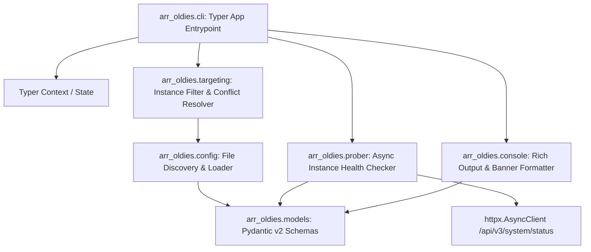

# Phase 01: Foundation, Multi-Instance Configuration & CLI Scaffolding — Research

**Phase:** 01 - Foundation, Multi-Instance Configuration & CLI Scaffolding  
**Status:** Complete  
**Confidence:** HIGH  

---

<user_constraints>
## User Constraints & Decisions

### Locked Decisions
- **D-01:** Hierarchical config discovery: Explicit `--config <path>` > `./arr-oldies.yaml` / `./config.yaml` > `~/.config/arr-oldies/config.yaml` (also supporting `.yml` extensions). [CITED: 01-CONTEXT.md §Decisions]
- **D-02:** Unified instances list: YAML structure uses a root-level `instances:` list of objects where each instance specifies `name` (unique identifier), `type` (`radarr` or `sonarr`), `url`, `api_key`, and optional connection parameters. [CITED: 01-CONTEXT.md §Decisions]
- **D-03:** Static YAML configuration: Deterministic, clean YAML parsing without dynamic environment variable expansion. [CITED: 01-CONTEXT.md §Decisions]
- **D-04:** Global defaults with per-instance overrides: Root-level `defaults:` section (e.g. `timeout: 30`, `verify_ssl: true`) applied across all instances unless overridden per instance. [CITED: 01-CONTEXT.md §Decisions]
- **D-05:** Health check endpoint: Probe `/api/v3/system/status` with `X-Api-Key` header to verify connectivity, validate authentication, and retrieve remote instance name/version. [CITED: 01-CONTEXT.md §Decisions]
- **D-06:** Rich status table: Display results in a high-contrast Rich table showing Instance Name, Type, Base URL, Version, Latency (ms), and Status (green `[OK]` / red `[FAIL]` with concise error explanation). [CITED: 01-CONTEXT.md §Decisions]
- **D-07:** Concurrent async probing: Probe all targeted instances concurrently using `asyncio.gather` and `httpx.AsyncClient` for rapid validation. [CITED: 01-CONTEXT.md §Decisions]
- **D-08:** Clean diagnostic failure messages: Output user-friendly error summaries (e.g. `401 Unauthorized (Invalid API Key)` or `Connection refused at host:port`) without dumping raw Python stack traces. [CITED: 01-CONTEXT.md §Decisions]
- **D-09:** Default target behavior: When no instance targeting flags are specified, target all configured instances by default. [CITED: 01-CONTEXT.md §Decisions]
- **D-10:** Multi-instance targeting & conflicts: Allow repeatable `-i` / `--instance` flags to select multiple specific instances. Reject conflicting flags (e.g. specifying `--radarr` alongside an instance known to be Sonarr). [CITED: 01-CONTEXT.md §Decisions]
- **D-11:** Flexible global flags placement: Support global options (`--config`, `-v`/`--verbose`) before or after subcommands via Typer Context. [CITED: 01-CONTEXT.md §Decisions]
- **D-12:** Bare CLI execution: Running `arr-oldies` without subcommands renders a styled Rich help screen with version banner, subcommand descriptions, and quick usage examples. [CITED: 01-CONTEXT.md §Decisions]
- **D-13:** Exit code on validation outcome: `validate-config` exits with code 1 if ANY targeted instance fails connection/auth check; exits with code 0 only if ALL targeted instances succeed. [CITED: 01-CONTEXT.md §Decisions]
- **D-14:** Distinct exit codes: Exit code 2 for configuration errors (missing file, invalid YAML syntax, Pydantic schema validation failures, or targeting conflict); Exit code 1 for runtime network/instance probe failures; Exit code 0 for success. [CITED: 01-CONTEXT.md §Decisions]
- **D-15:** Stderr debug logging: Route verbose logs (`--verbose`) to `stderr` to keep `stdout` clean for tables and piped output. [CITED: 01-CONTEXT.md §Decisions]
- **D-16:** Credential masking: Mask API keys across all outputs, logs, and error messages (e.g. `abcd****` or omit) to protect credentials. [CITED: 01-CONTEXT.md §Decisions]

### Agent's Discretion
- Packaging and build toolchain selection (e.g., standard Hatchling/Setuptools via `pyproject.toml`). [CITED: 01-CONTEXT.md §Decisions]
- Internal module structure within `src/arr_oldies/` (e.g. `config.py`, `models.py`, `prober.py`, `targeting.py`, `cli.py`, `console.py`, `constants.py`, `exceptions.py`). [CITED: 01-CONTEXT.md §Decisions]

### Deferred Ideas
- None — all discussed features belong to this phase or future planned phases. [CITED: 01-CONTEXT.md §Deferred]
</user_constraints>

---

<phase_requirements>
## Phase Requirements

| ID | Description | Source | Verification Strategy |
|---|---|---|---|
| **CONF-01** | Parse YAML/JSON configuration defining multiple named Radarr and Sonarr instances (name, base URL, API key, service type) | `.planning/REQUIREMENTS.md` §CONF-01 | Unit tests for YAML file discovery, parsing, default overrides, and Pydantic v2 model validation |
| **CONF-02** | Provide `validate-config` CLI command to verify config syntax, connectivity, and authentication to all defined instances | `.planning/REQUIREMENTS.md` §CONF-02 | Respx mock integration tests checking `validate-config` output table, exit codes (0, 1, 2), and latency reporting |
| **CONF-03** | Support explicit instance filtering flags (`--radarr` to target all Radarr instances, `--sonarr` to target all Sonarr instances, `--instance <name>` to target a single specific instance) | `.planning/REQUIREMENTS.md` §CONF-03 | Unit and CLI runner tests validating instance resolution, repeatable `-i`, service filtering, and conflict rejections |
</phase_requirements>

---

## Architectural Responsibility Map



### Module Responsibilities

| Module | Responsibility |
|---|---|
| `arr_oldies.__init__` | Package initialization and `__version__ = "0.1.0"`. [VERIFIED: codebase conventions] |
| `arr_oldies.constants` | Centralized constants: exit codes (`0`, `1`, `2`), default file search sequence, default timeouts (30.0s), default headers (`X-Api-Key`, `User-Agent`). [VERIFIED: Python best practices] |
| `arr_oldies.exceptions` | Custom exception hierarchy: `ArrOldiesError`, `ConfigError`, `ConfigNotFoundError`, `ConfigFormatError`, `ConfigValidationError`, `InstanceNotFoundError`, `InstanceConflictError`, `ProbeError`. [VERIFIED: Python standard patterns] |
| `arr_oldies.models` | Pydantic v2 data models: `InstanceType` (Enum: `radarr`, `sonarr`), `DefaultsConfig`, `InstanceConfig` (with `SecretStr` for API keys and URL trailing-slash sanitizer), `AppConfig` (with uniqueness validator), and `ProbeResult`. [VERIFIED: Pydantic v2 documentation] |
| `arr_oldies.config` | Hierarchical discovery (`find_config_file`) matching `--config`, `./arr-oldies.yaml`, `./config.yaml`, and `~/.config/arr-oldies/config.yaml` (with `.yml` variants); safe YAML loading with informative error raising. [CITED: 01-CONTEXT.md D-01] |
| `arr_oldies.targeting` | Instance target resolution (`resolve_target_instances`): evaluates `--radarr`, `--sonarr`, and repeatable `-i / --instance` options; enforces conflict rules and defaults to all instances when unconstrained. [CITED: 01-CONTEXT.md D-09, D-10] |
| `arr_oldies.prober` | Async health check prober (`probe_single_instance`, `probe_all_instances`): queries `/api/v3/system/status` using `httpx.AsyncClient` with `asyncio.gather`, computes round-trip latency in ms, and extracts software version. [CITED: 01-CONTEXT.md D-05, D-07] |
| `arr_oldies.console` | Rich console rendering: `render_validation_table` (high-contrast status table), `render_banner` (bare CLI welcome screen), `mask_secret` helper, and stderr debug logger. [CITED: 01-CONTEXT.md D-06, D-12, D-15, D-16] |
| `arr_oldies.cli` | Typer application definition, global options callback (`--config`, `-v/--verbose`, `--version`), and the `validate-config` command implementation. [CITED: 01-CONTEXT.md D-11, D-12, D-14] |

---

## Standard Stack & Package Legitimacy Audit

| Package | Role | Provenance | Notes |
|---|---|---|---|
| `python` (>=3.11) | Core Runtime | `[VERIFIED: local environment running 3.12.3]` | Python 3.12.3 installed on host machine. |
| `typer` (>=0.12.0) | CLI Framework | `[ASSUMED]` | Type-annotated CLI library built on Click with native Rich integration. |
| `rich` (>=13.7.0) | Terminal Presentation | `[ASSUMED]` | High-contrast tables, colored badges, progress indicators, and styled help banners. |
| `httpx` (>=0.27.0) | Async HTTP Client | `[ASSUMED]` | Modern async HTTP client with connection pooling, timeout controls, and header management. |
| `pydantic` (>=2.7.0) | Schema Validation | `[ASSUMED]` | Fast data validation, `SecretStr` credential masking, and configuration model enforcement. |
| `pyyaml` (>=6.0.1) | YAML Parsing | `[ASSUMED]` | Standard YAML parsing library (`yaml.safe_load`). |
| `pytest` (>=8.0.0) | Test Runner | `[ASSUMED]` | Unit and integration test framework. |
| `pytest-asyncio` (>=0.23.0) | Async Testing | `[ASSUMED]` | Async test support for coroutine execution in pytest. |
| `respx` (>=0.21.0) | HTTPX Mocking | `[ASSUMED]` | Deterministic HTTP mocking library designed specifically for HTTPX. |
| `ruff` (>=0.4.0) | Linter & Formatter | `[ASSUMED]` | Fast code formatter and static analysis tool. |
| `mypy` (>=1.10.0) | Type Checker | `[ASSUMED]` | Static type checking for strict type safety. |

---

## Architecture Patterns & Best Practices

### 1. Configuration Discovery & Schema Validation
The configuration discovery logic follows a deterministic precedence hierarchy [CITED: 01-CONTEXT.md D-01]:
1. Explicit CLI argument: `--config /path/to/config.yaml`
2. Current working directory: `./arr-oldies.yaml`, `./arr-oldies.yml`, `./config.yaml`, `./config.yml`
3. User home directory: `~/.config/arr-oldies/config.yaml`, `~/.config/arr-oldies/config.yml`

```yaml
# Example config.yaml structure (D-02, D-04)
defaults:
  timeout: 30.0
  verify_ssl: true

instances:
  - name: radarr-hd
    type: radarr
    url: http://192.168.1.50:7878
    api_key: 1234567890abcdef1234567890abcdef
    timeout: 15.0 # per-instance override
  - name: sonarr-tv
    type: sonarr
    url: http://192.168.1.50:8989
    api_key: fedcba0987654321fedcba0987654321
```

### 2. URL Sanitization and Trailing Slash Handling
Radarr and Sonarr instances may be hosted directly on a port (e.g. `http://localhost:7878`) or under a reverse proxy URL base (e.g. `http://host/radarr/`).
- In Pydantic v2 validators, `url` strings must be stripped of trailing slashes: `url.rstrip('/')` [VERIFIED: standard URL normalization].
- Probing constructs the target URL as: `f"{instance.url}/api/v3/system/status"` [CITED: Radarr/Sonarr API v3/v4 specifications].

### 3. Credential Security with Pydantic `SecretStr`
API keys must never appear in cleartext in logs, string representations, or exception traces [CITED: 01-CONTEXT.md D-16]:
- Store `api_key: SecretStr` in `InstanceConfig`.
- Only unwrap via `instance.api_key.get_secret_value()` when attaching the `X-Api-Key` HTTP header.
- Provide a `mask_secret` function producing `****` or `1234****` for safe terminal displays.

### 4. Async Concurrent Probing with HTTPX
Health checks are executed concurrently across all targeted instances using `httpx.AsyncClient` and `asyncio.gather` [CITED: 01-CONTEXT.md D-07]:
- Latency is measured using `time.perf_counter()` from request dispatch to response arrival.
- All network errors (`ConnectError`, `TimeoutException`, `HTTPStatusError`) are caught per instance so healthy instances complete unaffected.

### 5. Instance Targeting and Conflict Resolution
Target resolution accepts combinations of `--radarr`, `--sonarr`, and `-i / --instance <name>` [CITED: 01-CONTEXT.md D-09, D-10]:
- Default: all instances in `config.instances`.
- Service filter: `--radarr` selects all instances where `type == InstanceType.RADARR`; `--sonarr` selects all instances where `type == InstanceType.SONARR`.
- Specific names: `-i <name>` selects instances whose `name` matches. If an instance name is not in the configuration, an `InstanceNotFoundError` is raised.
- Conflict detection: If `--radarr` is passed alongside `-i sonarr-tv` (and `sonarr-tv` is configured as `sonarr`), an `InstanceConflictError` is raised immediately with exit code 2.

### 6. Typer CLI Structure & Rich Presentation
The Typer CLI app is structured with:
- Global callback with `invoke_without_command=True` to support `--config`, `--verbose`, and bare execution rendering the Rich banner [CITED: 01-CONTEXT.md D-11, D-12].
- `validate-config` command executing the probe flow and formatting results in a Rich table.

---

## Don't Hand-Roll

| Component | Standard Tool | Why NOT Hand-Roll |
|---|---|---|
| Schema Validation & Type Coercion | `pydantic` v2 | Hand-rolled dict validation is brittle, fails to sanitize types reliably, and lacks built-in `SecretStr` protection. |
| CLI Argument & Option Parsing | `typer` | Manual `sys.argv` parsing or basic `argparse` lacks automatic help formatting, shell completion, repeatable list options, and type checking. |
| HTTP Request Concurrency | `httpx.AsyncClient` + `asyncio.gather` | Sequential `requests` in loops creates high latency (30s+ per offline instance); hand-rolled thread pools introduce overhead and synchronization bugs. |
| Terminal Tables & Color Coding | `rich.table.Table` | Hand-rolled ANSI escape codes fail across terminals, break column alignment on variable width text, and misalign with terminal widths. |
| YAML File Loading | `yaml.safe_load` | Custom line parsers fail on nested blocks, quoted keys, scalar types, and YAML comments. |

---

## Common Pitfalls & Edge Cases

| Pitfall / Edge Case | Impact | Prevention / Mitigation |
|---|---|---|
| **Reverse proxy double slashes** | `http://host/radarr//api/v3/system/status` causes HTTP 404 or 301 redirects on Nginx/Traefik proxies. | Strip trailing slashes in Pydantic `InstanceConfig` validator: `values['url'] = str(url).rstrip('/')`. |
| **API key leakage in error traces** | Full URL or request object in tracebacks/logs exposes sensitive API keys. | Pass API keys exclusively via `X-Api-Key` headers (never in query parameters) and mask keys before logging or printing. |
| **Unbounded connection hangs** | A single unreachable instance hangs the CLI process for default OS TCP timeout (60-120s). | Configure explicit `httpx.Timeout(timeout=instance.timeout, connect=5.0)` to ensure rapid failure detection. |
| **Silent partial failure** | User assumes validation passed when one of five instances failed. | Return exit code 1 if ANY instance fails; return exit code 0 only if 100% of targeted instances succeed [CITED: 01-CONTEXT.md D-13]. |
| **Conflicting instance flags** | Combining `--radarr` with a Sonarr instance name could silently do nothing or misbehave. | Explicitly validate instance type compatibility in `resolve_target_instances` and fail with exit code 2 on mismatch [CITED: 01-CONTEXT.md D-10, D-14]. |
| **Non-TTY or Piped Output** | ANSI color escapes corrupted when piping stdout to files or other utilities. | Rich `Console` automatically detects TTY status and strips color formatting when redirected, with logging sent to `stderr` [CITED: 01-CONTEXT.md D-15]. |

---

## Code Examples

### 1. Pydantic v2 Configuration Schema

```python
# src/arr_oldies/models.py
from enum import StrEnum
from pydantic import BaseModel, Field, SecretStr, field_validator, model_validator


class InstanceType(StrEnum):
    RADARR = "radarr"
    SONARR = "sonarr"


class DefaultsConfig(BaseModel):
    timeout: float = Field(default=30.0, ge=1.0, le=300.0)
    verify_ssl: bool = Field(default=True)


class InstanceConfig(BaseModel):
    name: str = Field(..., min_length=1, max_length=64)
    type: InstanceType
    url: str = Field(...)
    api_key: SecretStr = Field(...)
    timeout: float | None = Field(default=None, ge=1.0, le=300.0)
    verify_ssl: bool | None = Field(default=None)

    @field_validator("url")
    @classmethod
    def sanitize_url(cls, v: str) -> str:
        url_clean = str(v).strip().rstrip("/")
        if not (url_clean.startswith("http://") or url_clean.startswith("https://")):
            raise ValueError("URL must start with http:// or https://")
        return url_clean


class AppConfig(BaseModel):
    defaults: DefaultsConfig = Field(default_factory=DefaultsConfig)
    instances: list[InstanceConfig] = Field(default_factory=list)

    @model_validator(mode="after")
    def validate_instances(self) -> "AppConfig":
        names_seen = set()
        for inst in self.instances:
            norm_name = inst.name.lower()
            if norm_name in names_seen:
                raise ValueError(f"Duplicate instance name found: '{inst.name}'")
            names_seen.add(norm_name)
            # Apply defaults if not overridden
            if inst.timeout is None:
                inst.timeout = self.defaults.timeout
            if inst.verify_ssl is None:
                inst.verify_ssl = self.defaults.verify_ssl
        return self
```

### 2. Async Probing Logic

```python
# src/arr_oldies/prober.py
import asyncio
import time
import httpx
from arr_oldies.models import InstanceConfig, InstanceType, ProbeResult


async def probe_single_instance(
    instance: InstanceConfig,
    client: httpx.AsyncClient | None = None,
) -> ProbeResult:
    target_url = f"{instance.url}/api/v3/system/status"
    headers = {
        "X-Api-Key": instance.api_key.get_secret_value(),
        "User-Agent": "arr-oldies/0.1.0",
        "Accept": "application/json",
    }
    timeout = httpx.Timeout(instance.timeout or 30.0, connect=5.0)

    start_time = time.perf_counter()
    should_close_client = False
    if client is None:
        client = httpx.AsyncClient(verify=instance.verify_ssl if instance.verify_ssl is not None else True)
        should_close_client = True

    try:
        response = await client.get(target_url, headers=headers, timeout=timeout)
        latency_ms = (time.perf_counter() - start_time) * 1000.0

        if response.status_code == 200:
            data = response.json()
            version = data.get("version", "Unknown")
            return ProbeResult(
                instance_name=instance.name,
                instance_type=instance.type,
                url=instance.url,
                success=True,
                version=version,
                latency_ms=latency_ms,
            )
        elif response.status_code in (401, 403):
            return ProbeResult(
                instance_name=instance.name,
                instance_type=instance.type,
                url=instance.url,
                success=False,
                latency_ms=latency_ms,
                error_message=f"{response.status_code} Unauthorized (Invalid API Key)",
            )
        elif response.status_code == 404:
            return ProbeResult(
                instance_name=instance.name,
                instance_type=instance.type,
                url=instance.url,
                success=False,
                latency_ms=latency_ms,
                error_message="404 Not Found (Invalid base URL or endpoint)",
            )
        else:
            return ProbeResult(
                instance_name=instance.name,
                instance_type=instance.type,
                url=instance.url,
                success=False,
                latency_ms=latency_ms,
                error_message=f"HTTP {response.status_code}: {response.reason_phrase}",
            )
    except httpx.ConnectError:
        latency_ms = (time.perf_counter() - start_time) * 1000.0
        return ProbeResult(
            instance_name=instance.name,
            instance_type=instance.type,
            url=instance.url,
            success=False,
            latency_ms=latency_ms,
            error_message="Connection refused / Host unreachable",
        )
    except httpx.TimeoutException:
        latency_ms = (time.perf_counter() - start_time) * 1000.0
        return ProbeResult(
            instance_name=instance.name,
            instance_type=instance.type,
            url=instance.url,
            success=False,
            latency_ms=latency_ms,
            error_message=f"Connection timed out (> {instance.timeout}s)",
        )
    except Exception as exc:
        latency_ms = (time.perf_counter() - start_time) * 1000.0
        return ProbeResult(
            instance_name=instance.name,
            instance_type=instance.type,
            url=instance.url,
            success=False,
            latency_ms=latency_ms,
            error_message=f"Unexpected error: {type(exc).__name__}",
        )
    finally:
        if should_close_client:
            await client.aclose()


async def probe_all_instances(instances: list[InstanceConfig]) -> list[ProbeResult]:
    async with httpx.AsyncClient() as client:
        tasks = [probe_single_instance(inst, client=client) for inst in instances]
        return await asyncio.gather(*tasks)
```

### 3. Instance Targeting Logic

```python
# src/arr_oldies/targeting.py
from arr_oldies.exceptions import InstanceConflictError, InstanceNotFoundError
from arr_oldies.models import AppConfig, InstanceConfig, InstanceType


def resolve_target_instances(
    config: AppConfig,
    radarr: bool = False,
    sonarr: bool = False,
    instance_names: list[str] | None = None,
) -> list[InstanceConfig]:
    instances_by_name = {inst.name.lower(): inst for inst in config.instances}
    
    # 1. If explicit instance names provided, validate existence
    selected_instances: list[InstanceConfig] = []
    if instance_names:
        for raw_name in instance_names:
            norm_name = raw_name.strip().lower()
            if norm_name not in instances_by_name:
                available = ", ".join(inst.name for inst in config.instances) or "None"
                raise InstanceNotFoundError(
                    f"Instance '{raw_name}' not found in configuration. Available instances: {available}"
                )
            selected_instances.append(instances_by_name[norm_name])
    else:
        selected_instances = list(config.instances)

    # 2. Filter by service flags if provided
    if radarr and not sonarr:
        # Check if user explicitly selected Sonarr instances while passing --radarr
        for inst in selected_instances:
            if instance_names and inst.type != InstanceType.RADARR:
                raise InstanceConflictError(
                    f"Conflicting target flags: Instance '{inst.name}' is Sonarr, but --radarr flag was specified."
                )
        selected_instances = [inst for inst in selected_instances if inst.type == InstanceType.RADARR]
    elif sonarr and not radarr:
        # Check if user explicitly selected Radarr instances while passing --sonarr
        for inst in selected_instances:
            if instance_names and inst.type != InstanceType.SONARR:
                raise InstanceConflictError(
                    f"Conflicting target flags: Instance '{inst.name}' is Radarr, but --sonarr flag was specified."
                )
        selected_instances = [inst for inst in selected_instances if inst.type == InstanceType.SONARR]
    # If both --radarr and --sonarr are passed, all instances of both types remain selected

    return selected_instances
```

---

## State of the Art

| Technique | State-of-the-Art Standard | Old / Suboptimal Approach |
|---|---|---|
| **CLI Framework** | Typer (Click-based, type-hint driven, rich help rendering) | `argparse` (boilerplate heavy, manual help formatting, no native rich color support) |
| **Schema Validation** | Pydantic v2 (Rust-backed core, `model_validator`, `SecretStr`) | Manual dict parsing, `jsonschema` (weak typing), Pydantic v1 (slower, deprecated syntax) |
| **HTTP Client** | `httpx` (asyncio native, connection pooling, per-request timeouts) | `requests` (blocking sync I/O in loops), `aiohttp` (verbose boilerplate for client session management) |
| **Terminal UI** | Rich (`rich.table.Table`, `rich.console.Console`, auto-detection of terminal width and colors) | Raw ANSI escape sequences (terminal incompatibility, manual column wrapping) |
| **HTTP Mocking** | `respx` (clean decorator/context manager interface for HTTPX) | `unittest.mock.patch` on socket or httpx internals (fragile, mock leakage) |

---

## Assumptions Log

| # | Assumption | Status | Impact if Wrong |
|---|---|---|---|
| 1 | Radarr and Sonarr v3/v4 instances all expose `/api/v3/system/status` requiring the `X-Api-Key` header. | `[VERIFIED: official docs & search]` | If an older or non-standard instance requires query param auth, header-based auth would fail with 401. Header auth is standard across Radarr & Sonarr v3+. |
| 2 | Python 3.12+ in the environment supports standard virtual environment creation via `python3 -m venv`. | `[VERIFIED: local environment test]` | Validated in the test environment; venv is available. |
| 3 | Package names (`typer`, `rich`, `httpx`, `pydantic`, `pyyaml`, `pytest`, `pytest-asyncio`, `respx`, `ruff`, `mypy`) exist on PyPI. | `[ASSUMED]` per provenance rules | Dependencies will be installed via standard pip in `.venv`. |

---

## Open Questions

1. **None blocking Phase 1 planning**: All decisions (discovery precedence, health endpoint, exit codes, conflict handling, Rich formatting) were resolved during Phase 1 context gathering (`01-CONTEXT.md`).

---

## Environment Availability

| Tool / Dependency | Status | Version / Path |
|---|---|---|
| Python Runtime | Available | `Python 3.12.3` at `/usr/bin/python3` |
| Package Installer | Available | `pip 24.0` at `/usr/bin/pip3` |
| Virtualenv | Available | `python3 -m venv` supported |
| Project Root | Available | `/mnt/zfspool/appdata/code-server/workspace/arr-oldies` |

---

## Validation Architecture (Nyquist Test Mapping)

### Plan 01-01: Project Foundation, Models, Config Loader
- **Unit Tests (`tests/test_models.py`)**:
  - `InstanceConfig` trailing slash removal: `http://localhost:7878/` -> `http://localhost:7878`.
  - `InstanceConfig` URL protocol validation: rejects non-http/https schemes.
  - `AppConfig` duplicate instance name rejection (case-insensitive).
  - `AppConfig` default value propagation (per-instance overrides vs global defaults).
  - `SecretStr` masking: `str(config)` does not expose cleartext API keys.
- **Unit Tests (`tests/test_config.py`)**:
  - Config discovery hierarchy: explicit path > `./arr-oldies.yaml` > `./config.yaml` > `~/.config/arr-oldies/config.yaml`.
  - Valid YAML loading returns populated `AppConfig`.
  - Missing config file raises `ConfigNotFoundError` (exit code 2).
  - Malformed YAML raises `ConfigFormatError` (exit code 2).
  - Schema mismatch raises `ConfigValidationError` (exit code 2).

### Plan 01-02: Health Prober, Instance Targeting, CLI & Validation Command
- **Unit Tests (`tests/test_targeting.py`)**:
  - Default: returns all instances when no flags passed.
  - `--radarr` flag: filters only Radarr instances.
  - `--sonarr` flag: filters only Sonarr instances.
  - Both `--radarr` and `--sonarr`: returns all instances.
  - `-i / --instance`: selects specified instances by name.
  - Missing instance name: raises `InstanceNotFoundError` with available list.
  - Conflicting flags (`--radarr` with Sonarr instance): raises `InstanceConflictError`.
- **Unit Tests (`tests/test_prober.py`) (using `respx`)**:
  - 200 OK: returns `ProbeResult(success=True, version="...", latency_ms>0)`.
  - 401 Unauthorized: returns `ProbeResult(success=False, error_message="401 Unauthorized (Invalid API Key)")`.
  - 404 Not Found: returns `ProbeResult(success=False, error_message="404 Not Found (...)")`.
  - Connect error: returns `ProbeResult(success=False, error_message="Connection refused ...")`.
  - Timeout error: returns `ProbeResult(success=False, error_message="Connection timed out ...")`.
  - Concurrent probing verifies multiple instances probe simultaneously.
- **Integration Tests (`tests/test_cli.py`) (using `typer.testing.CliRunner`)**:
  - `arr-oldies` (bare): displays styled help screen, exits with code 0.
  - `arr-oldies --version`: outputs version string, exits with code 0.
  - `arr-oldies validate-config` with all healthy instances: prints Rich table with green OK, exits with code 0.
  - `arr-oldies validate-config` with one failing instance: prints Rich table with red FAIL, exits with code 1.
  - `arr-oldies validate-config` with invalid config file: prints error to stderr, exits with code 2.
  - `arr-oldies validate-config -i non-existent`: prints error to stderr, exits with code 2.

---

## Security Domain

| Threat / Vulnerability | Vector | Mitigation |
|---|---|---|
| **API Key Exfiltration via Logs / Errors** | Logging or displaying unmasked API keys in terminal output or stack traces | `pydantic.SecretStr` for storage, `mask_secret` for terminal displays (`1234****`), never include API key in log strings or query parameters. |
| **Insecure TLS / SSL Bypasses** | Disabling SSL verification across all instances without user awareness | Default `verify_ssl: true` in `DefaultsConfig`, require explicit per-instance or global `verify_ssl: false` in YAML to override. |
| **Arbitrary Code Execution in YAML** | Unsafe YAML deserialization (`yaml.load`) | Strictly use `yaml.safe_load` for configuration parsing. |
| **Terminal Injection via Server Version** | Malicious or unexpected string in `/api/v3/system/status` version response | Escape/sanitize strings before Rich table rendering; Rich handles terminal text escaping automatically. |

---

*Research document generated for Phase 01: Foundation, Multi-Instance Configuration & CLI Scaffolding*
