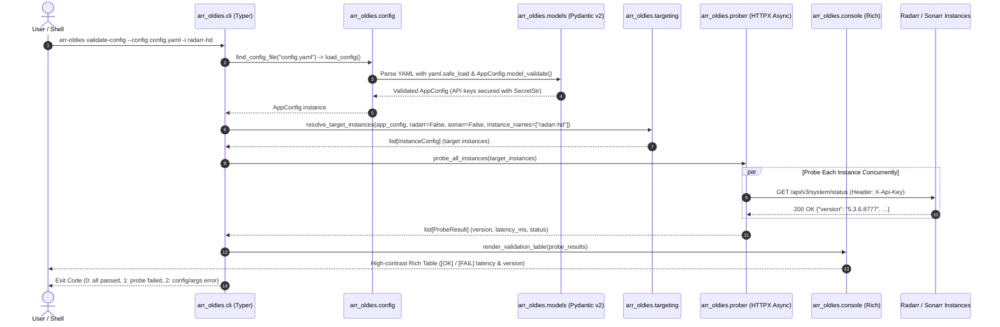

# Walking Skeleton Architecture: Foundation, Configuration & CLI Scaffolding

**Phase:** 01 - Foundation, Multi-Instance Configuration & CLI Scaffolding  
**Status:** Planned  
**Architecture Pattern:** Modular Async CLI Pipeline (Pydantic v2 + PyYAML + HTTPX + Typer + Rich)

---

## 1. Walking Skeleton Purpose

The Walking Skeleton is the minimal end-to-end implementation of the core architectural pipeline for `arr-oldies`. It establishes the foundational vertical slice connecting CLI argument parsing, configuration discovery, schema validation, concurrent async HTTP probing against remote Radarr/Sonarr instances, terminal presentation, and deterministic process exit codes.

```
[ CLI Invocation ] -> [ Typer & Context ] -> [ File Discovery & PyYAML ]
       |                                                 |
       v                                                 v
[ Rich Console / Exit Code ] <- [ Async Prober ] <- [ Pydantic Schemas & Targeting ]
```

Every subsequent phase (API client expansion, History API batching, timestamp correlation, Rich table reporting, and the Safe Action Engine) builds directly on the contracts, exception hierarchies, and data models established here.

---

## 2. Component Breakdown & Data Flow



---

## 3. Core Architectural Modules

### 3.1 `arr_oldies.constants`
- Centralized constants across the application:
  - Exit codes: `EXIT_SUCCESS = 0`, `EXIT_PROBE_ERROR = 1`, `EXIT_CONFIG_ERROR = 2`.
  - Config discovery paths: `./arr-oldies.yaml`, `./arr-oldies.yml`, `./config.yaml`, `./config.yml`, `~/.config/arr-oldies/config.yaml`, `~/.config/arr-oldies/config.yml`.
  - Network defaults: default timeout `30.0s`, connect timeout `5.0s`, `User-Agent: arr-oldies/0.1.0`.

### 3.2 `arr_oldies.exceptions`
- Explicit, structured exception hierarchy:
  - `ArrOldiesError`: Base exception for all domain errors.
  - `ConfigError`: Base configuration error (maps to exit code 2).
    - `ConfigNotFoundError`: Configuration file does not exist.
    - `ConfigFormatError`: YAML syntax error.
    - `ConfigValidationError`: Pydantic schema validation failure.
  - `InstanceError`: Base instance error.
    - `InstanceNotFoundError`: Requested instance name does not exist in configuration.
    - `InstanceConflictError`: Incompatible filter flags (e.g. `--radarr` with Sonarr instance).
  - `ProbeError`: Base probing error (maps to exit code 1).

### 3.3 `arr_oldies.models`
- Pydantic v2 data contracts:
  - `InstanceType(StrEnum)`: `radarr`, `sonarr`.
  - `DefaultsConfig`: Global fallback settings (`timeout: float = 30.0`, `verify_ssl: bool = True`).
  - `InstanceConfig`: Per-instance configuration (`name`, `type`, `url`, `api_key: SecretStr`, `timeout`, `verify_ssl`). Includes trailing-slash URL sanitizer (`url.rstrip('/')`) and scheme validator (`http://` or `https://`).
  - `AppConfig`: Root configuration object with duplicate instance name validator and defaults inheritance logic.
  - `ProbeResult`: Immutable health check record (`instance_name`, `instance_type`, `url`, `success`, `version`, `latency_ms`, `error_message`).

### 3.4 `arr_oldies.config`
- `find_config_file(explicit_path)`: Hierarchical discovery adhering to D-01.
- `load_config(config_path)`: Safe YAML parsing (`yaml.safe_load`) adhering to D-03 and T-01-03, translating validation errors into clean diagnostics.

### 3.5 `arr_oldies.targeting`
- `resolve_target_instances(config, radarr, sonarr, instance_names)`: Resolves target instance subset per D-09, supports repeatable `-i` flags per D-10, and detects conflicting service flags with exit code 2 per D-14.

### 3.6 `arr_oldies.prober`
- `probe_single_instance(instance, client)`: Async HTTP prober querying `/api/v3/system/status` per D-05, computing millisecond round-trip latency, and translating HTTP 401/403/404, connection errors, and timeouts into user-friendly summaries per D-08.
- `probe_all_instances(instances)`: Concurrent prober using `asyncio.gather` per D-07.

### 3.7 `arr_oldies.console`
- Rich terminal output formatting:
  - `render_validation_table(results)`: Renders high-contrast table per D-06.
  - `render_banner()`: Renders styled welcome screen for bare CLI execution per D-12.
  - `mask_secret(key)`: Credential masking per D-16.
  - `print_error(msg)`: Routes diagnostic errors to `stderr` per D-15.

### 3.8 `arr_oldies.cli`
- Typer application with global option callbacks (`--config`, `-v/--verbose`, `--version`) per D-11 and `validate-config` command implementation.

---

## 4. Verification Harness

The walking skeleton is verified through automated tests covering all layers:

| Layer | Test Module | Tooling | Coverage Focus |
|---|---|---|---|
| Models | `tests/test_models.py` | pytest | URL sanitization, SecretStr protection, duplicate names, defaults merging |
| Config | `tests/test_config.py` | pytest, tmp_path | Discovery precedence, missing files, YAML syntax errors, schema mismatches |
| Targeting | `tests/test_targeting.py` | pytest | Default selection, `--radarr`/`--sonarr` filters, `-i` multi-select, conflict rejections |
| Prober | `tests/test_prober.py` | pytest, pytest-asyncio, respx | HTTP 200/401/404, timeouts, connection errors, concurrency |
| CLI / App | `tests/test_cli.py` | typer.testing.CliRunner | Bare execution, `--version`, `validate-config` exit codes (0, 1, 2), stderr routing |

---

## 5. Security & Isolation Boundaries

1. **Credential Boundary (T-01-01 / D-16):** API keys are parsed directly into Pydantic `SecretStr`. Stringification (`repr` / `str`) never prints the secret. The unwrapped key is used strictly in `X-Api-Key` request headers. All console displays mask keys.
2. **TLS / SSL Boundary (T-01-02):** SSL verification defaults to `true`. Disabling verification requires explicit `verify_ssl: false` configuration.
3. **Deserialization Boundary (T-01-03 / D-03):** Parsing strictly uses `yaml.safe_load` to prevent arbitrary object instantiation or code execution.
