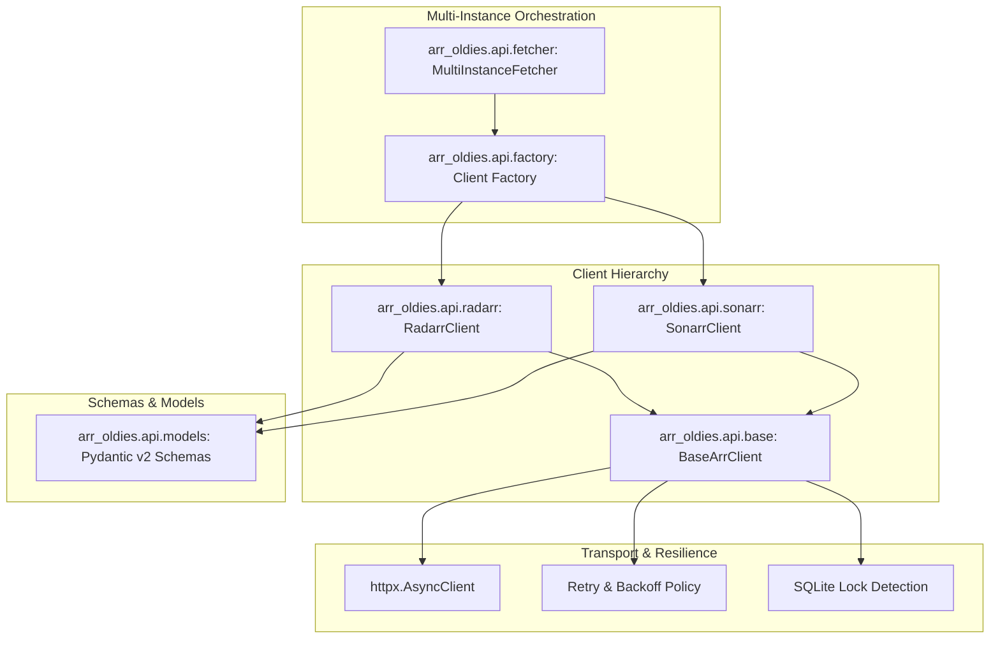
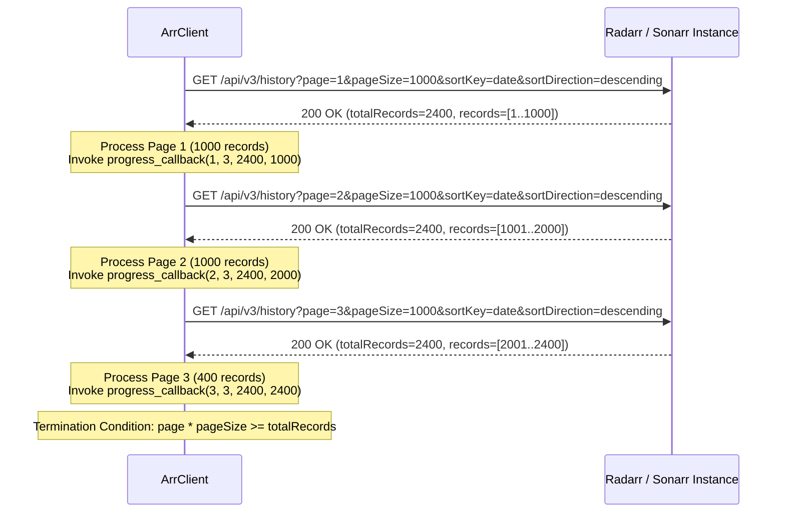

# Phase 02: Async *arr API Clients & Batch History Fetcher — Research

**Phase:** 02 - Async *arr API Clients & Batch History Fetcher  
**Status:** Ready to Plan  
**Confidence:** HIGH  

---

<user_constraints>
## User Constraints & Decisions

### Project Constraints & Directives
- **C-01:** Tech stack: Python 3.11+ using `httpx>=0.27.0`, `pydantic>=2.7.0`, `rich>=13.7.0`, `typer>=0.12.0`, `pyyaml>=6.0.1`. [CITED: AGENTS.md §Core Technologies]
- **C-02:** Strict API compliance: Target standard Radarr v3/v4 and Sonarr v3/v4 REST APIs. Do not perform direct filesystem reads or direct SQLite database mutations. [CITED: AGENTS.md §Constraints, .planning/REQUIREMENTS.md §Out of Scope]
- **C-03:** Strict History API dependency: Rely on `/api/v3/history` endpoints to resolve precise download and import event timestamps (`downloadFolderImported`, `grabbed`). [CITED: AGENTS.md §Constraints, .planning/REQUIREMENTS.md §API-01, API-02]
- **C-04:** Batch history pagination: Optimize page size to 500–1000 items/page to prevent *arr database lock timeouts and memory exhaustion. [CITED: .planning/REQUIREMENTS.md §API-03]
- **C-05:** Multi-instance resilience: Unreachable or failing instances must emit clear diagnostic warnings without terminating scans or data gathering on healthy instances. [CITED: .planning/REQUIREMENTS.md §API-04]
- **C-06:** Credential protection: All API keys must remain masked (`SecretStr`) in client representations, debug logs, and diagnostic error output. [CITED: Phase 1 D-16]

### Key Decisions Inherited from Phase 1
- **D-01:** Configuration model: `InstanceConfig` provides `name`, `type` (`InstanceType.RADARR` | `InstanceType.SONARR`), `url`, `api_key` (`SecretStr`), `timeout`, and `verify_ssl`. [CITED: `arr_oldies.models.InstanceConfig`]
- **D-02:** Async concurrency: Use `asyncio.gather` across distinct instances with dedicated or pooled `httpx.AsyncClient` instances. [CITED: Phase 1 D-07]
- **D-03:** Clean diagnostic errors: Avoid raw Python stack trace dumps; convert HTTP and transport exceptions into structured domain exceptions. [CITED: Phase 1 D-08]

### Agent's Discretion
- Module decomposition within `src/arr_oldies/api/` (e.g. `base.py`, `models.py`, `radarr.py`, `sonarr.py`, `fetcher.py`).
- Exact retry backoff curve, jitter algorithm, and transient HTTP status codes (429, 502, 503, 504).
- Internal concurrency limits per instance (`asyncio.Semaphore`) to throttle sub-resource requests (such as Sonarr series episode file queries).
</user_constraints>

---

<phase_requirements>
## Phase Requirements

| ID | Description | Source | Verification Strategy |
|---|---|---|---|
| **API-01** | Async HTTPX client for Radarr v3/v4 endpoints (`/api/v3/movie`, `/api/v3/moviefile`, `/api/v3/history`, `/api/v3/history/movie`) | `.planning/REQUIREMENTS.md` §API-01 | Unit & integration tests with `respx` mocking for all 4 Radarr endpoints, verifying headers, payload parsing, and error paths |
| **API-02** | Async HTTPX client for Sonarr v3/v4 endpoints (`/api/v3/series`, `/api/v3/episodefile`, `/api/v3/episode`, `/api/v3/history`, `/api/v3/history/series`) | `.planning/REQUIREMENTS.md` §API-02 | Unit & integration tests with `respx` mocking for all 5 Sonarr endpoints, verifying series ID filtering and nested model parsing |
| **API-03** | Batch history pagination with optimized page size (500–1000) and connection concurrency limits to avoid *arr SQLite database locks | `.planning/REQUIREMENTS.md` §API-03 | Mock multi-page history pagination tests verifying page iteration, `totalRecords` cutoff, semaphore throttling, and SQLite busy error retries |
| **API-04** | Resilient error handling per instance so unreachable or failing instances emit clear warnings without aborting scans of healthy instances | `.planning/REQUIREMENTS.md` §API-04 | Concurrent multi-instance fetch tests where one instance fails (e.g. 500 error, connect timeout) and healthy instances complete successfully |
</phase_requirements>

---

## Architectural Responsibility Map



### Module Responsibilities

| Module | Responsibility |
|---|---|
| `arr_oldies.api.models` | Pydantic v2 schemas for Radarr & Sonarr API responses: `MediaInfo`, `RadarrMovie`, `RadarrMovieFile`, `RadarrHistoryRecord`, `RadarrHistoryPage`, `SonarrSeries`, `SonarrEpisodeFile`, `SonarrEpisode`, `SonarrHistoryRecord`, `SonarrHistoryPage`. All models use `ConfigDict(extra="ignore")` for forwards compatibility. |
| `arr_oldies.api.base` | `BaseArrClient` managing `httpx.AsyncClient` lifecycle, connection limits (`httpx.Limits`), headers (`X-Api-Key`, `User-Agent`), request dispatching with exponential backoff/jitter retries, and SQLite lock error translation. |
| `arr_oldies.api.radarr` | `RadarrClient` implementing `get_movies()`, `get_movie_files()`, `get_history()`, `get_movie_history()`, and `fetch_all_history()`. |
| `arr_oldies.api.sonarr` | `SonarrClient` implementing `get_series()`, `get_episode_files()`, `get_episodes()`, `get_history()`, `get_series_history()`, and `fetch_all_history()`. |
| `arr_oldies.api.fetcher` | Resilient multi-instance fetch orchestrator (`fetch_instance_data`, `fetch_all_instances_data`) that queries multiple instances concurrently, catches per-instance failures, and yields structured results (`InstanceFetchResult`) with warning/error metadata. |
| `arr_oldies.constants` | Centralized network defaults: default history page size (1000), minimum/maximum page size (100–1000), max connection limits (10 max, 5 keepalive), retry attempts (3), backoff multiplier (0.5s), and endpoint constants. |
| `arr_oldies.exceptions` | Domain exception taxonomy for API operations: `ArrClientError`, `ArrConnectionError`, `ArrTimeoutError`, `ArrAuthenticationError`, `ArrNotFoundError`, `ArrResponseError`, `ArrDatabaseLockedError`. |

---

## Standard Stack & Package Legitimacy Audit

| Package | Role | Status | Notes |
|---|---|---|---|
| `python` (>=3.11) | Core Runtime | `[VERIFIED: 3.12.3 in .venv]` | Fully supports async context managers, modern type syntax (`X \| None`), and task groups. |
| `httpx` (>=0.27.0) | Async HTTP Client | `[VERIFIED: 0.28.1 in .venv]` | High-performance async client with connection pooling, timeouts, and streaming support. |
| `pydantic` (>=2.7.0) | Schema Validation | `[VERIFIED: 2.13.4 in .venv]` | Fast Rust-backed schema parsing; `ConfigDict(extra="ignore")` protects against minor API schema drift. |
| `pytest-asyncio` (>=0.23.0) | Async Test Runner | `[VERIFIED: 1.4.0 in .venv]` | Seamless `async def test_*` execution with `asyncio_mode = "auto"`. |
| `respx` (>=0.21.0) | HTTPX Mocking | `[VERIFIED: 0.23.1 in .venv]` | Deterministic mocking of HTTPX requests, status codes, JSON bodies, and transport exceptions. |
| `rich` (>=13.7.0) | Terminal Presentation | `[VERIFIED: 15.0.0 in .venv]` | Progress bars and live status rendering during multi-page history fetching. |

---

## Deep-Dive Technical Research

### 1. Radarr REST API v3/v4 Specifications

#### Endpoint Summary
- **`GET /api/v3/movie`**
  - **Purpose:** Retrieve all movies in the Radarr library.
  - **Parameters:** None required.
  - **Payload Structure:** Returns `list[MovieResource]`.
  - **Key Properties:**
    - `id`: int
    - `title`: str
    - `year`: int
    - `path`: str
    - `monitored`: bool
    - `hasFile`: bool
    - `movieFileId`: int | None
    - `movieFile`: `MovieFileResource | None` (embedded when `hasFile=True`)
    - `genres`: list[str] (optional)
    - `sizeOnDisk`: int | None

- **`GET /api/v3/moviefile` & `GET /api/v3/moviefile?movieId={movieId}`**
  - **Purpose:** Retrieve movie file records for a specific movie or library.
  - **Parameters:** `movieId` (int, optional).
  - **Payload Structure:** Returns `list[MovieFileResource]` or single `MovieFileResource`.
  - **Key Properties:**
    - `id`: int
    - `movieId`: int
    - `relativePath`: str
    - `path`: str
    - `size`: int (bytes)
    - `dateAdded`: str (ISO-8601 timestamp)
    - `indexerFlags`: int | None
    - `quality`: dict | None
    - `mediaInfo`: `MediaInfoResource | None`

- **`GET /api/v3/history`**
  - **Purpose:** Paginated history of movie events (grabs, imports, renames, deletions).
  - **Query Parameters:**
    - `page`: int (1-indexed, default 1)
    - `pageSize`: int (records per page, recommended 500–1000)
    - `sortKey`: str (`"date"`)
    - `sortDir`: str (`"desc"` or `"descending"`)
    - `eventType`: int | str | None (e.g. `1` for grabbed, `3` for imported)
  - **Payload Structure:**
    ```json
    {
      "page": 1,
      "pageSize": 1000,
      "sortKey": "date",
      "sortDirection": "descending",
      "totalRecords": 14250,
      "records": [
        {
          "id": 1024,
          "movieId": 42,
          "sourceTitle": "Movie.Title.2023.1080p.BluRay.x264",
          "eventType": "downloadFolderImported",
          "date": "2026-01-15T14:22:10Z",
          "data": {
            "fileId": "85",
            "importedPath": "/movies/Movie Title (2023)/Movie Title (2023).mkv",
            "droppedPath": "/downloads/complete/Movie.Title.2023.1080p.BluRay.x264.mkv"
          }
        }
      ]
    }
    ```

- **`GET /api/v3/history/movie?movieId={movieId}`**
  - **Purpose:** Retrieve full history log for an individual movie.
  - **Query Parameters:** `movieId` (int, required), `eventType` (optional).
  - **Payload Structure:** Returns `list[HistoryResource]`.

---

### 2. Sonarr REST API v3/v4 Specifications

#### Endpoint Summary
- **`GET /api/v3/series`**
  - **Purpose:** Retrieve all TV series in the Sonarr library.
  - **Parameters:** None required.
  - **Payload Structure:** Returns `list[SeriesResource]`.
  - **Key Properties:**
    - `id`: int
    - `title`: str
    - `year`: int
    - `path`: str
    - `monitored`: bool
    - `seasons`: `list[SeasonResource]` (with `seasonNumber`, `monitored`, `statistics`)
    - `statistics`: dict (e.g. `episodeFileCount`, `totalEpisodeCount`, `sizeOnDisk`)

- **`GET /api/v3/episodefile?seriesId={seriesId}`**
  - **Purpose:** Retrieve all episode files associated with a specific series.
  - **Query Parameters:** `seriesId` (int, required).
  - **Payload Structure:** Returns `list[EpisodeFileResource]`.
  - **Key Properties:**
    - `id`: int
    - `seriesId`: int
    - `seasonNumber`: int
    - `relativePath`: str
    - `path`: str
    - `size`: int (bytes)
    - `dateAdded`: str (ISO-8601 timestamp)
    - `quality`: dict | None
    - `mediaInfo`: `MediaInfoResource | None`

- **`GET /api/v3/episode?seriesId={seriesId}` & `GET /api/v3/episode?episodeFileId={episodeFileId}`**
  - **Purpose:** Retrieve episode metadata records.
  - **Query Parameters:** `seriesId` (int, optional), `episodeFileId` (int, optional).
  - **Payload Structure:** Returns `list[EpisodeResource]`.
  - **Key Properties:**
    - `id`: int
    - `seriesId`: int
    - `episodeFileId`: int | None
    - `seasonNumber`: int
    - `episodeNumber`: int
    - `title`: str
    - `airDateUtc`: str | None
    - `monitored`: bool
    - `hasFile`: bool

- **`GET /api/v3/history`**
  - **Purpose:** Paginated history of series/episode events.
  - **Query Parameters:**
    - `page`: int (1-indexed, default 1)
    - `pageSize`: int (records per page, recommended 500–1000)
    - `sortKey`: str (`"date"`)
    - `sortDirection`: str (`"descending"`)
    - `includeSeries`: bool (`true`)
    - `includeEpisode`: bool (`true`)
    - `eventType`: int | str | None
  - **Payload Structure:**
    ```json
    {
      "page": 1,
      "pageSize": 1000,
      "sortKey": "date",
      "sortDirection": "descending",
      "totalRecords": 35800,
      "records": [
        {
          "id": 9812,
          "episodeId": 450,
          "seriesId": 12,
          "sourceTitle": "Show.Name.S02E05.1080p.WEB-DL",
          "eventType": "downloadFolderImported",
          "date": "2026-02-10T18:05:00Z",
          "data": {
            "fileId": "120",
            "importedPath": "/tv/Show Name/Season 02/Show.Name.S02E05.mkv",
            "droppedPath": "/downloads/Show.Name.S02E05.1080p.mkv"
          }
        }
      ]
    }
    ```

- **`GET /api/v3/history/series?seriesId={seriesId}`**
  - **Purpose:** Retrieve history records for a specific series.
  - **Query Parameters:** `seriesId` (int, required), `seasonNumber` (int, optional).
  - **Payload Structure:** Returns `list[HistoryResource]`.

---

### 3. MediaInfo & History Event Types

#### MediaInfo Structure
Both Radarr and Sonarr populate a `mediaInfo` object inside movie and episode file records:

```json
{
  "audioCodec": "EAC3",
  "audioChannels": 5.1,
  "audioProfile": "Atmos",
  "audioLanguages": "eng/fre/ita",
  "audioTitle": "English",
  "videoCodec": "x265",
  "videoBitdepth": 10,
  "videoBitrate": 4500000,
  "videoFps": 23.976,
  "resolution": "1920x1080",
  "runTime": "00:44:12",
  "scanType": "Progressive",
  "subtitles": "eng/spa"
}
```

> [!NOTE]
> `audioLanguages` is commonly formatted as a slash-delimited ISO language string (e.g. `"eng/ita"`, `"fra/eng"`, or `"English/French"`), or a single language string (`"eng"`). If media analysis has not yet run on an item, `mediaInfo` may be `None` or an empty object. Our Pydantic model must tolerate missing or null values gracefully.

#### History Event Types Reference
| Event Name | Numeric Code (Legacy) | Description | Role in Arr-Oldies |
|---|---|---|---|
| `grabbed` | `1` | Release sent to download client | Resolves original grab / release discovery date |
| `downloadFolderImported` | `3` | File imported to final library directory | Resolves primary download / import completion date |
| `downloadFailed` | `2` | Download failed in download client | Ignored during age calculation |
| `movieFileDeleted` / `episodeFileDeleted` | `4` | File removed from disk | Ignored or used for audit trace |
| `movieFileRenamed` / `episodeFileRenamed` | `5` | File renamed on disk | Preserved if needed |
| `downloadIgnored` | `6` | Release ignored | Ignored |

---

### 4. HTTPX Connection Pooling & Request Engine

#### Connection Limits & Timeouts
Radarr and Sonarr instances running on self-hosted servers (Synology, Unraid, TrueNAS, Raspberry Pi) can experience socket exhaustion or SQLite concurrency contention if overwhelmed with parallel connections.

Recommended Client Configuration:
```python
httpx.Limits(
    max_connections=10,  # Maximum simultaneous TCP connections per instance
    max_keepalive_connections=5,  # Active connections kept warm in pool
    keepalive_expiry=30.0,  # Keep-alive timeout in seconds
)
```

Timeout Configuration:
```python
httpx.Timeout(
    timeout=instance.timeout or 30.0,  # Overall read/write timeout
    connect=5.0,  # Fast socket connect timeout
)
```

#### Headers
Every request must automatically inject:
- `X-Api-Key`: Instance secret API key
- `User-Agent`: `arr-oldies/{__version__}`
- `Accept`: `application/json`

---

### 5. Retry Policy & SQLite Lock Mitigation (API-03)

#### The SQLite Database Lock Problem
*arr applications utilize SQLite with WAL mode. During heavy background scans, RSS syncs, or backup tasks, concurrent HTTP requests querying large history tables can encounter SQLite lock contention:
- Status Code: HTTP `500 Internal Server Error` or `503 Service Unavailable`
- Response Body: Contains `Microsoft.Data.Sqlite.SqliteException: SQLite Error 5: 'database is locked'`, `SQLiteBusyException`, or `database is locked`.

#### Mitigation Strategy
1. **Batch Size Tuning:** Use `pageSize=1000` (or `500`) instead of unbounded or massive page sizes.
2. **Sequential History Pagination:** Paginate history pages sequentially per instance rather than launching 50 parallel page requests simultaneously.
3. **Bounded Concurrency for Sub-resources:** When querying Sonarr episode files across dozens of series, use an internal `asyncio.Semaphore(3)` to cap concurrency.
4. **Exponential Backoff with Jitter:** On encountering HTTP 429, 502, 503, 504, or SQLite lock messages, retry up to `DEFAULT_RETRY_ATTEMPTS` (3) times with exponential backoff:
   $$\text{delay} = \text{base\_backoff} \times 2^{\text{attempt}} + \text{uniform}(0, 0.2)$$
5. **Honor `Retry-After` Header:** If a 429 response includes a `Retry-After` header, sleep for the indicated duration (capped at 15.0s max).

```python
# SQLite Lock Detection Pattern
def _is_sqlite_lock(response: httpx.Response) -> bool:
    if response.status_code in (500, 503):
        text = response.text.lower()
        return (
            "database is locked" in text
            or "sqlitebusyexception" in text
            or "sqlite error 5" in text
        )
    return False
```

---

### 6. Batch History Pagination Algorithm



#### Pagination Generator & Collector
The client provides two interfaces:
1. `iter_history(page_size=1000, max_pages=None, ...)`: Async generator yielding `HistoryPage` or individual `HistoryRecord` objects.
2. `fetch_all_history(page_size=1000, max_pages=None, progress_callback=None)`: Coroutine aggregating all records into a single `list[HistoryRecord]`.

---

### 7. Multi-Instance Resilient Fetching Engine (API-04)

When auditing a multi-instance deployment (e.g. `radarr-hd`, `radarr-4k`, `sonarr-tv`, `sonarr-anime`):
- If `radarr-4k` is powered off or unreachable, it should **not** abort the scan of `radarr-hd`, `sonarr-tv`, and `sonarr-anime`.
- `MultiInstanceFetcher` uses `asyncio.gather(*tasks, return_exceptions=True)` to execute queries across instances in parallel.
- Each instance result is wrapped in an `InstanceFetchResult[T]`:
  ```python
  class InstanceFetchResult[T](BaseModel):
      instance_name: str
      instance_type: InstanceType
      url: str
      success: bool
      data: T | None = None
      error_message: str | None = None
      warning_message: str | None = None
      item_count: int = 0
      latency_ms: float = 0.0
  ```
- Any network timeout or authentication failure records `success=False` with a human-readable `error_message`, allowing downstream consumers (Phase 3 inventory engine and Phase 4 reporting) to process healthy instances and report clear warnings for failed ones.

---

## Detailed Data Models (Pydantic v2)

```python
"""arr_oldies.api.models — Data schemas for Radarr and Sonarr REST API responses."""

from datetime import datetime
from typing import Any
from pydantic import BaseModel, ConfigDict, Field


class ApiBaseModel(BaseModel):
    """Base model configured to ignore extra fields for API forward compatibility."""

    model_config = ConfigDict(extra="ignore", populate_by_name=True)


class MediaInfo(ApiBaseModel):
    """Media technical stream metadata extracted from media file."""

    audio_codec: str | None = Field(default=None, alias="audioCodec")
    audio_channels: float | None = Field(default=None, alias="audioChannels")
    audio_profile: str | None = Field(default=None, alias="audioProfile")
    audio_languages: str | None = Field(default=None, alias="audioLanguages")
    audio_title: str | None = Field(default=None, alias="audioTitle")
    video_codec: str | None = Field(default=None, alias="videoCodec")
    video_bitdepth: int | None = Field(default=None, alias="videoBitdepth")
    resolution: str | None = Field(default=None, alias="resolution")
    run_time: str | None = Field(default=None, alias="runTime")
    subtitles: str | None = Field(default=None, alias="subtitles")


# --- Radarr Models ---


class RadarrMovieFile(ApiBaseModel):
    """Movie media file descriptor."""

    id: int
    movie_id: int = Field(alias="movieId")
    relative_path: str = Field(alias="relativePath")
    path: str
    size: int
    date_added: datetime = Field(alias="dateAdded")
    indexer_flags: int | None = Field(default=None, alias="indexerFlags")
    media_info: MediaInfo | None = Field(default=None, alias="mediaInfo")


class RadarrMovie(ApiBaseModel):
    """Radarr movie library entry."""

    id: int
    title: str
    year: int
    path: str
    monitored: bool
    has_file: bool = Field(alias="hasFile")
    movie_file_id: int | None = Field(default=None, alias="movieFileId")
    movie_file: RadarrMovieFile | None = Field(default=None, alias="movieFile")
    size_on_disk: int | None = Field(default=None, alias="sizeOnDisk")
    genres: list[str] = Field(default_factory=list)


class RadarrHistoryRecord(ApiBaseModel):
    """Radarr history event record."""

    id: int
    movie_id: int = Field(alias="movieId")
    source_title: str = Field(alias="sourceTitle")
    event_type: str = Field(alias="eventType")
    date: datetime
    data: dict[str, Any] = Field(default_factory=dict)
    download_id: str | None = Field(default=None, alias="downloadId")


class RadarrHistoryPage(ApiBaseModel):
    """Paginated history response from Radarr."""

    page: int
    page_size: int = Field(alias="pageSize")
    total_records: int = Field(alias="totalRecords")
    records: list[RadarrHistoryRecord] = Field(default_factory=list)


# --- Sonarr Models ---


class SonarrSeason(ApiBaseModel):
    """Sonarr series season metadata."""

    season_number: int = Field(alias="seasonNumber")
    monitored: bool
    statistics: dict[str, Any] | None = Field(default=None)


class SonarrSeries(ApiBaseModel):
    """Sonarr series library entry."""

    id: int
    title: str
    year: int
    path: str
    monitored: bool
    seasons: list[SonarrSeason] = Field(default_factory=list)


class SonarrEpisodeFile(ApiBaseModel):
    """Sonarr episode media file descriptor."""

    id: int
    series_id: int = Field(alias="seriesId")
    season_number: int = Field(alias="seasonNumber")
    relative_path: str = Field(alias="relativePath")
    path: str
    size: int
    date_added: datetime = Field(alias="dateAdded")
    media_info: MediaInfo | None = Field(default=None, alias="mediaInfo")


class SonarrEpisode(ApiBaseModel):
    """Sonarr episode metadata."""

    id: int
    series_id: int = Field(alias="seriesId")
    episode_file_id: int | None = Field(default=None, alias="episodeFileId")
    season_number: int = Field(alias="seasonNumber")
    episode_number: int = Field(alias="episodeNumber")
    title: str
    air_date_utc: datetime | None = Field(default=None, alias="airDateUtc")
    monitored: bool
    has_file: bool = Field(alias="hasFile")


class SonarrHistoryRecord(ApiBaseModel):
    """Sonarr history event record."""

    id: int
    series_id: int = Field(alias="seriesId")
    episode_id: int = Field(alias="episodeId")
    source_title: str = Field(alias="sourceTitle")
    event_type: str = Field(alias="eventType")
    date: datetime
    data: dict[str, Any] = Field(default_factory=dict)
    download_id: str | None = Field(default=None, alias="downloadId")


class SonarrHistoryPage(ApiBaseModel):
    """Paginated history response from Sonarr."""

    page: int
    page_size: int = Field(alias="pageSize")
    total_records: int = Field(alias="totalRecords")
    records: list[SonarrHistoryRecord] = Field(default_factory=list)
```

---

## Exception Hierarchy & Diagnostic Mapping

```python
"""Exception hierarchy for arr-oldies API operations."""


class ArrClientError(ArrOldiesError):
    """Base exception for all *arr API client communication failures."""


class ArrConnectionError(ArrClientError):
    """Network connection failure, host unreachable, or DNS failure."""


class ArrTimeoutError(ArrClientError):
    """HTTP request or connection timeout exceeded."""


class ArrAuthenticationError(ArrClientError):
    """HTTP 401 or 403: Invalid API key or unauthorized access."""


class ArrNotFoundError(ArrClientError):
    """HTTP 404: Endpoint, movie, series, or resource not found."""


class ArrResponseError(ArrClientError):
    """Server returned an unexpected HTTP 4xx or 5xx status code."""

    def __init__(self, status_code: int, message: str) -> None:
        self.status_code = status_code
        super().__init__(f"HTTP {status_code}: {message}")


class ArrDatabaseLockedError(ArrResponseError):
    """Server SQLite database is locked (SQLiteBusyException / error 5)."""

    def __init__(self, message: str = "Instance database is locked") -> None:
        super().__init__(status_code=500, message=message)
```

---

## Implementation Plan Preview

### Plan 02-01: Base Async Client, API Models & Resilience Infrastructure
- **Objective:** Create `arr_oldies.api.models`, domain exception classes, and `BaseArrClient` featuring connection pooling, retry policies with backoff/jitter, SQLite lock detection, and unit test suites.
- **Key Deliverables:**
  - `src/arr_oldies/api/__init__.py`
  - `src/arr_oldies/api/models.py` (Pydantic v2 schemas)
  - `src/arr_oldies/api/base.py` (`BaseArrClient`)
  - `src/arr_oldies/exceptions.py` (Extended hierarchy)
  - `tests/test_api_base.py` & `tests/test_api_models.py`

### Plan 02-02: RadarrClient, SonarrClient, Batch History Pagination & Multi-Instance Fetcher
- **Objective:** Implement `RadarrClient` and `SonarrClient` for all required v3/v4 endpoints, sequential batch history pagination engine, and `MultiInstanceFetcher` for resilient multi-instance data acquisition.
- **Key Deliverables:**
  - `src/arr_oldies/api/radarr.py` (`RadarrClient`)
  - `src/arr_oldies/api/sonarr.py` (`SonarrClient`)
  - `src/arr_oldies/api/fetcher.py` (`MultiInstanceFetcher`)
  - `src/arr_oldies/api/factory.py` (Client instantiation factory)
  - `tests/test_radarr_client.py`, `tests/test_sonarr_client.py`, `tests/test_fetcher.py`

---

## Risk Analysis & Mitigation Strategies

| Risk | Severity | Impact | Mitigation Strategy |
|---|---|---|---|
| **SQLite database lock during history pagination** | HIGH | *arr instance crashes or returns 500 errors during scan | Enforce default batch page size of 1000 items, paginate sequentially per instance, and implement exponential backoff retry on detecting lock errors. |
| **Schema variations across Radarr/Sonarr v3 vs v4** | MEDIUM | Pydantic validation failure on unexpected or missing fields | Use `model_config = ConfigDict(extra="ignore")` across all API models; declare optional fields with defaults. |
| **Slow or hanging instance blocking entire scan** | HIGH | User experience degrades; CLI hangs indefinitely | Configure explicit connection timeouts (5.0s) and request timeouts (30.0s); execute multi-instance scans concurrently with isolated error trapping per instance. |
| **Large series count in Sonarr causing HTTP socket storms** | MEDIUM | Sonarr server throttles requests or runs out of sockets | Throttle series episode file queries using an internal `asyncio.Semaphore(3)` per client. |
| **Memory spikes on massive history logs (>100k records)** | LOW | CLI process memory consumption increases | Stream history records via generator (`iter_history`) or store lightweight Pydantic models with only required fields. |

---

## Verification & Testing Matrix

| Test Area | Scope | Tools | Success Threshold |
|---|---|---|---|
| **API Models Validation** | Serialization / deserialization of mock JSON payloads from Radarr/Sonarr | `pytest`, `pydantic` | 100% pass; valid ISO-8601 timestamps, nested `mediaInfo`, and field aliases validated. |
| **Base Client Retries** | HTTP 429 rate limiting, 503 errors, transport drops, and SQLite busy error retries | `pytest`, `respx` | Retries triggered with backoff; `Retry-After` honored; final failure converted to typed exception. |
| **Radarr Client Endpoints** | `/api/v3/movie`, `/api/v3/moviefile`, `/api/v3/history`, `/api/v3/history/movie` | `pytest`, `respx` | Accurate typing and model conversion for all 4 endpoints; single and multi-page history fetched. |
| **Sonarr Client Endpoints** | `/api/v3/series`, `/api/v3/episodefile`, `/api/v3/episode`, `/api/v3/history`, `/api/v3/history/series` | `pytest`, `respx` | Accurate typing and model conversion for all 5 endpoints; series ID query parameters verified. |
| **Batch History Pagination** | Multi-page pagination termination conditions (`page * pageSize >= totalRecords`, empty records) | `pytest`, `respx` | Exactly N pages requested; progress callback invoked on each page; all records aggregated. |
| **Multi-Instance Resilience** | Concurrent fetch across healthy and failing instances | `pytest`, `respx` | Healthy instance data returned intact; failed instance records diagnostic warning without raising unhandled exception. |
