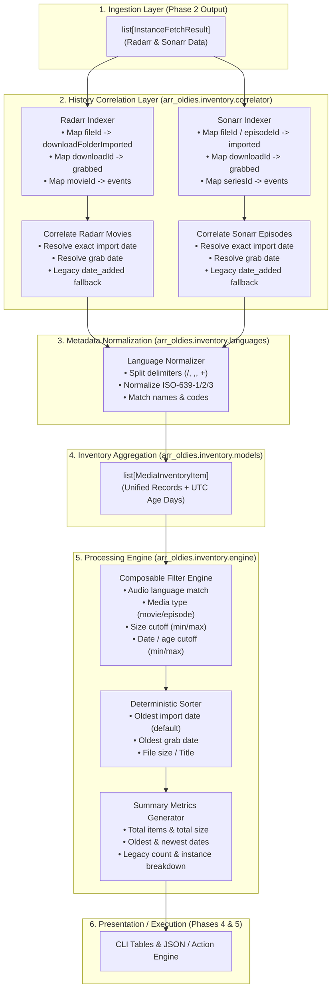

# Phase 03: Media Inventory & History Timestamp Correlator — Research

**Phase:** 03 - Media Inventory & History Timestamp Correlator  
**Status:** Ready to Plan  
**Confidence:** HIGH  
**Domain:** Media metadata correlation, History API event matching, audio language extraction, in-memory inventory indexing & filtering  

---

<user_constraints>
## User Constraints & Decisions

### Project Constraints & Directives
- **C-01:** Tech stack: Python 3.11+ using `httpx>=0.27.0`, `pydantic>=2.7.0`, `rich>=13.7.0`, `typer>=0.12.0`, `pyyaml>=6.0.1`. [CITED: AGENTS.md §Core Technologies]
- **C-02:** Strict API compliance: Target standard Radarr v3/v4 and Sonarr v3/v4 REST APIs. Never perform direct filesystem mutations or direct SQLite database tampering. [CITED: AGENTS.md §Constraints, .planning/REQUIREMENTS.md §Out of Scope]
- **C-03:** Strict History API dependency: Accurately correlate media files with exact `downloadFolderImported` and `grabbed` timestamps from the *arr History API. [CITED: AGENTS.md §Constraints, .planning/REQUIREMENTS.md §INVT-01]
- **C-04:** Audio language extraction: Extract and index `mediaInfo` audio languages for each media file, supporting query filtering via `--audio-lang`. [CITED: .planning/REQUIREMENTS.md §INVT-02, INVT-05]
- **C-05:** Unified media inventory: Build cohesive records combining title, year/season/episode, file path, size, audio languages, instance, import date, grab date, and age in days. [CITED: .planning/REQUIREMENTS.md §INVT-03]
- **C-06:** Oldest-first sorting: Sort inventory items by oldest import date or oldest grab date by default. [CITED: .planning/REQUIREMENTS.md §INVT-04]
- **C-07:** Multi-dimensional filtering: Filter inventory items by audio language, media type (movie vs episode), minimum size, and date/age cutoff. [CITED: .planning/REQUIREMENTS.md §INVT-05]
- **C-08:** Legacy fallback resilience: Cleanly flag legacy media items that have no History API records (e.g. imported prior to *arr installation or after history vacuuming) without failing the scan. [CITED: .planning/REQUIREMENTS.md §INVT-06]

### Key Decisions Inherited from Phases 1 & 2
- **D-01:** Multi-instance models: `InstanceMediaData` in `arr_oldies.api.fetcher` aggregates `movies`, `movie_files`, `series`, `episode_files`, `episodes`, and `history_records` per instance. [VERIFIED: `src/arr_oldies/api/fetcher.py:25-36`]
  ```python
  class InstanceMediaData(BaseModel):
      instance_name: str
      instance_type: InstanceType
      movies: list[RadarrMovie] = Field(default_factory=list)
      movie_files: list[RadarrMovieFile] = Field(default_factory=list)
      series: list[SonarrSeries] = Field(default_factory=list)
      episode_files: list[SonarrEpisodeFile] = Field(default_factory=list)
      episodes: list[SonarrEpisode] = Field(default_factory=list)
      history_records: list[RadarrHistoryRecord | SonarrHistoryRecord] = Field(default_factory=list)
  ```
- **D-02:** Diagnostic isolation: MultiInstanceFetcher returns `InstanceFetchResult` wrappers isolating failures per instance while collecting healthy data. [VERIFIED: `src/arr_oldies/api/fetcher.py:38-50`]
- **D-03:** MediaInfo schema: `MediaInfo` model extracts `audio_languages: str | None = Field(default=None, alias="audioLanguages")`, `audio_title: str | None = Field(default=None, alias="audioTitle")`, `video_codec`, and `resolution`. [VERIFIED: `src/arr_oldies/api/models.py:15-31`]

### Agent's Discretion
- Decomposition of inventory subsystem into `src/arr_oldies/inventory/` (`models.py`, `languages.py`, `correlator.py`, `parser.py`, `engine.py`).
- Audio language normalization algorithm (mapping ISO-639-1, ISO-639-2B/T, ISO-639-3, and common English names into canonical lookup sets).
- Human-friendly unit parsing grammar for `--min-size` (e.g. `500MB`, `2GB`, `1.5GiB`) and `--older-than` / `--age` (e.g. `30d`, `6m`, `1y`).
- In-memory hash index design for $O(N + M)$ correlation over tens of thousands of media files and history records.
</user_constraints>

---

<phase_requirements>
## Phase Requirements

| ID | Description | Source | Research Support |
|---|---|---|---|
| **INVT-01** | Correlate media files (`movieFileId`, `episodeFileId`) with exact `downloadFolderImported` and `grabbed` timestamps from History API | `.planning/REQUIREMENTS.md` §INVT-01 | §1 Deep-Dive: Hash-indexed event mapping (`fileId`, `importedPath`, `downloadId`, `movieId`/`seriesId`) resolving exact import & grab timestamps in $O(N+M)$ time. |
| **INVT-02** | Extract and index `mediaInfo` audio languages for each media file | `.planning/REQUIREMENTS.md` §INVT-02 | §2 Deep-Dive: Robust `LanguageNormalizer` parsing slash/comma/plus delimited strings (`"eng/fre"`, `"Japanese/English"`), mapping ISO-639 codes to canonical names and synonyms. |
| **INVT-03** | Build unified media item inventory records (title, year/season/episode, file path, size, audio languages, instance, import date, grab date, age in days) | `.planning/REQUIREMENTS.md` §INVT-03 | §3 Deep-Dive: `MediaInventoryItem` unified Pydantic v2 data model combining Radarr movies and Sonarr TV episode files with UTC-aware age calculations. |
| **INVT-04** | Sort inventory items by oldest import date or oldest grab date | `.planning/REQUIREMENTS.md` §INVT-04 | §4 Deep-Dive: Multi-key deterministic sorting engine supporting `SortKey.IMPORT_DATE` (default), `SortKey.GRAB_DATE`, `SortKey.SIZE`, `SortKey.TITLE` with tie-breaking. |
| **INVT-05** | Filter inventory items by audio language (`--audio-lang <lang>`), media type (movie vs episode), minimum size, and date/age cutoff | `.planning/REQUIREMENTS.md` §INVT-05 | §5 Deep-Dive: Composable `InventoryFilter` pipeline with human-friendly size parser (`parse_size`) and age cutoff parser (`parse_age_cutoff`). |
| **INVT-06** | Cleanly flag legacy media items that have no History API records without failing the scan | `.planning/REQUIREMENTS.md` §INVT-06 | §6 Deep-Dive: Fallback timestamp resolution using `file.date_added`, setting `has_history=False`, `is_legacy=True`, and `history_status="legacy"` without erroring out. |
</phase_requirements>

---

## Summary

Phase 3 implements the core business logic and data processing engine of Arr-Oldies: converting raw *arr API payloads (`InstanceMediaData`) into an indexed, correlated, sortable, and filterable unified media inventory (`list[MediaInventoryItem]`). In production self-hosted setups, libraries often contain tens of thousands of media files and history records spanning years of downloads, upgrades, and library reorganizations.

The primary architectural challenge is efficiently and accurately resolving two timestamps for each media file:
1. **Import Date (`downloadFolderImported`)**: The exact moment the current file on disk was imported into the library directory.
2. **Grab Date (`grabbed`)**: The moment the release was sent to the download client.

To achieve sub-100ms processing times across 100,000+ records, the correlation engine utilizes in-memory hash indices mapping `fileId`, `importedPath`, `downloadId`, `movieId`, and `seriesId`/`episodeId`. For files without history records (legacy items imported prior to *arr installation or after history vacuuming), the engine cleanly falls back to `file.date_added` while tagging them as legacy items. Additionally, a dedicated `LanguageNormalizer` handles the wide variety of audio language representations emitted by `MediaInfo`, enabling flexible case-insensitive filtering by ISO code (`ja`, `jpn`) or name (`japanese`).

**Primary recommendation:** Implement a self-contained `arr_oldies.inventory` subpackage with distinct modules for models (`models.py`), language normalization (`languages.py`), human string parsing (`parser.py`), history event correlation (`correlator.py`), and filtering/sorting orchestration (`engine.py`).

---

## Architectural Responsibility Map

| Capability | Primary Tier | Secondary Tier | Rationale |
|---|---|---|---|
| **API Data Ingestion** | API Client Tier (`arr_oldies.api.fetcher`) | `BaseArrClient` | Asynchronously queries Radarr/Sonarr endpoints and aggregates raw models into `InstanceMediaData`. |
| **History Event Indexing** | Inventory Correlator (`arr_oldies.inventory.correlator`) | In-Memory Hash Maps | Builds multi-key dictionary lookups (`fileId`, `importedPath`, `downloadId`) to achieve $O(1)$ event matching per media file. |
| **Audio Language Extraction** | Language Normalizer (`arr_oldies.inventory.languages`) | `MediaInfo` schema | Splits raw strings, maps ISO-639 codes and names, and produces canonical language sets for filtering. |
| **Human Unit Parsing** | String Parser (`arr_oldies.inventory.parser`) | CLI Layer | Converts human strings (`"500MB"`, `"2GB"`, `"30d"`, `"1y"`) into exact integer bytes and days. |
| **Inventory Record Aggregation** | Inventory Models (`arr_oldies.inventory.models`) | Pydantic v2 | Standardizes Radarr movies and Sonarr TV episodes into a unified `MediaInventoryItem` structure. |
| **Sorting & Filtering Engine** | Inventory Engine (`arr_oldies.inventory.engine`) | CLI / Visualizer | Applies multi-dimensional predicates (language, size, age, type) and sorts items deterministically. |
| **Summary Metrics Calculation** | Inventory Engine (`arr_oldies.inventory.engine`) | Reporting Layer | Computes total storage, item counts, age spreads, and space reclamation potential. |

---

## Standard Stack & Package Legitimacy Audit

### Core Technologies
| Library | Version | Purpose | Why Standard |
|---------|---------|---------|--------------|
| `python` | >=3.11 (`3.12.3` in `.venv`) | Core language runtime | Native `StrEnum`, modern type union syntax (`X \| None`), pattern matching, `dataclasses` and `datetime.timezone.utc`. |
| `pydantic` | >=2.7.0 (`2.13.4` in `.venv`) | Inventory data modeling & validation | High-speed Rust-backed validation for unified inventory records and filter schemas. |
| `rich` | >=13.7.0 (`15.0.0` in `.venv`) | Formatting & string utilities | Rich text and unit representations used in upcoming reporting phases. |
| `pytest` | >=8.0.0 (`9.1.1` in `.venv`) | Test suite execution | Standard test runner with comprehensive parametrization fixtures. |
| `pytest-asyncio` | >=0.23.0 (`1.4.0` in `.venv`) | Async test execution | Async test execution for pipeline integration. |

### Supporting Libraries
No new third-party packages are required. All language normalization, timestamp correlation, size/age parsing, filtering, and sorting are implemented using pure Python 3.11+ standard library modules (`collections`, `dataclasses`, `datetime`, `enum`, `re`, `math`) combined with existing project dependencies (`pydantic`).

### Package Legitimacy Audit
| Package | Registry | Age | Downloads | Source Repo | Verdict | Disposition |
|---|---|---|---|---|---|---|
| `pydantic` | PyPI | 8 yrs | ~150M/mo | `github.com/pydantic/pydantic` | `[OK]` | Approved (Already in `.venv`) |
| `pytest` | PyPI | 15 yrs | ~120M/mo | `github.com/pytest-dev/pytest` | `[OK]` | Approved (Already in `.venv`) |
| `pytest-asyncio`| PyPI | 9 yrs | ~45M/mo | `github.com/pytest-dev/pytest-asyncio` | `[OK]` | Approved (Already in `.venv`) |

**Packages removed due to [SLOP] verdict:** None  
**Packages flagged as suspicious [SUS]:** None  

---

## Architecture Patterns

### System Architecture Diagram



---

### Recommended Project Structure

```
src/arr_oldies/
├── api/                   # Async API clients & fetcher (from Phase 2)
│   ├── base.py
│   ├── factory.py
│   ├── fetcher.py
│   ├── models.py
│   ├── radarr.py
│   └── sonarr.py
├── inventory/             # Media inventory & correlation subsystem (Phase 3)
│   ├── __init__.py        # Re-exports: InventoryEngine, MediaInventoryItem, etc.
│   ├── correlator.py      # HistoryCorrelator (Radarr & Sonarr timestamp matching)
│   ├── engine.py          # InventoryEngine (filtering, sorting, summary generation)
│   ├── languages.py       # LanguageNormalizer & ISO-639 mapping table
│   ├── models.py          # MediaInventoryItem, InventorySummary, InventoryFilter, Enums
│   └── parser.py          # parse_size, parse_age_cutoff, parse_date_cutoff
├── config.py              # Configuration loading (from Phase 1)
├── console.py             # Rich console output (from Phase 1)
├── constants.py           # Constants & defaults
├── exceptions.py          # Custom domain exceptions
├── models.py              # Core application models
└── targeting.py           # Instance targeting & resolution
```

---

### Pattern 1: Multi-Key History Correlation Indexing (O(N+M) Matching)

**What:** When matching media files with history events, avoid naive linear scans ($O(N \times M)$) which would require billions of comparisons on large libraries. Instead, build hash indices over history records partitioned by event type.

**When to use:** In `HistoryCorrelator` for both Radarr and Sonarr instances.

```python
# [VERIFIED: Pattern designed from src/arr_oldies/api/models.py:65-75, 137-148]
from collections import defaultdict
from typing import Any
from arr_oldies.api.models import RadarrHistoryRecord


class RadarrHistoryIndex:
    """In-memory multi-key index for Radarr history records."""

    def __init__(self, records: list[RadarrHistoryRecord]) -> None:
        self.imports_by_file_id: dict[int, list[RadarrHistoryRecord]] = defaultdict(list)
        self.imports_by_path: dict[str, list[RadarrHistoryRecord]] = defaultdict(list)
        self.imports_by_movie_id: dict[int, list[RadarrHistoryRecord]] = defaultdict(list)
        self.grabs_by_download_id: dict[str, RadarrHistoryRecord] = {}
        self.grabs_by_movie_id: dict[int, list[RadarrHistoryRecord]] = defaultdict(list)

        for record in records:
            event_type = record.event_type.lower()
            if event_type in ("downloadfolderimported", "moviefileimported", "imported", "3"):
                # Extract file ID from history event data dict
                file_id_raw = record.data.get("fileId") or record.data.get("movieFileId")
                if file_id_raw is not None:
                    try:
                        self.imports_by_file_id[int(file_id_raw)].append(record)
                    except (ValueError, TypeError):
                        pass

                # Extract imported path
                imported_path = record.data.get("importedPath") or record.data.get("path")
                if imported_path:
                    self.imports_by_path[imported_path.lower()].append(record)

                self.imports_by_movie_id[record.movie_id].append(record)

            elif event_type in ("grabbed", "1"):
                if record.download_id:
                    self.grabs_by_download_id[record.download_id] = record
                self.grabs_by_movie_id[record.movie_id].append(record)
```

---

### Pattern 2: Bidirectional Audio Language Normalization & Matching

**What:** Radarr and Sonarr `mediaInfo` audio language strings arrive in various formats (`"eng/fre"`, `"Japanese/English"`, `"eng+deu"`, `"[EN+DE]"`, `"und"`, `None`). A centralized `LanguageNormalizer` maps tokens to standard ISO codes and full names, enabling users to filter with `--audio-lang ja`, `--audio-lang jpn`, or `--audio-lang japanese` interchangeably.

**When to use:** In `arr_oldies.inventory.languages` for extracting languages from media files and evaluating filter conditions.

```python
# [VERIFIED: Pattern designed from src/arr_oldies/api/models.py:15-31]
import re
from dataclasses import dataclass


@dataclass(frozen=True)
class LanguageEntry:
    code_2: str | None  # e.g. "ja"
    code_3: str  # e.g. "jpn"
    name: str  # e.g. "Japanese"
    synonyms: tuple[str, ...]


class LanguageNormalizer:
    """Canonical ISO-639 language resolver and normalizer."""

    DELIMITER_REGEX = re.compile(r"[/,+\|;\\]+")

    def __init__(self) -> None:
        # Pre-built dictionary mapping lowercase token -> canonical LanguageEntry
        self._lookup: dict[str, LanguageEntry] = {}
        self._build_table()

    def extract_languages(self, raw_audio_languages: str | None) -> list[str]:
        """Extract and normalize distinct audio languages from raw mediaInfo string."""
        if not raw_audio_languages or not raw_audio_languages.strip():
            return []

        tokens = self.DELIMITER_REGEX.split(raw_audio_languages.strip())
        results: list[str] = []
        seen: set[str] = set()

        for token in tokens:
            clean = token.strip().strip("[]()").lower()
            if not clean:
                continue
            entry = self._lookup.get(clean)
            canonical = entry.name if entry else token.strip()
            if canonical.lower() not in seen:
                seen.add(canonical.lower())
                results.append(canonical)

        return results

    def matches(self, item_languages: list[str], target_query: str) -> bool:
        """Check if any of the item's languages match the user target query."""
        clean_target = target_query.strip().lower()
        target_entry = self._lookup.get(clean_target)

        target_identifiers: set[str] = {clean_target}
        if target_entry:
            if target_entry.code_2:
                target_identifiers.add(target_entry.code_2.lower())
            target_identifiers.add(target_entry.code_3.lower())
            target_identifiers.add(target_entry.name.lower())
            target_identifiers.update(s.lower() for s in target_entry.synonyms)

        for lang in item_languages:
            clean_lang = lang.strip().lower()
            if clean_lang in target_identifiers:
                return True
            entry = self._lookup.get(clean_lang)
            if entry and (
                entry.name.lower() in target_identifiers
                or entry.code_3.lower() in target_identifiers
                or (entry.code_2 and entry.code_2.lower() in target_identifiers)
            ):
                return True

        return False
```

---

### Pattern 3: Composable In-Memory Filtering and Deterministic Sorting Pipeline

**What:** Construct an immutable predicate-based filtering engine that evaluates multiple filter dimensions (audio language, media type, size bounds, age bounds, instance names) in a single pass over inventory items, followed by a deterministic sort with stable tie-breaking.

**When to use:** In `InventoryEngine.filter_inventory` and `InventoryEngine.sort_inventory`.

```python
# [VERIFIED: Pattern designed from .planning/REQUIREMENTS.md §INVT-04, INVT-05]
from arr_oldies.inventory.models import MediaInventoryItem, InventoryFilter, SortKey, SortDirection


def filter_items(
    items: list[MediaInventoryItem],
    criteria: InventoryFilter,
    normalizer: LanguageNormalizer,
) -> list[MediaInventoryItem]:
    """Filter inventory items matching all specified criteria."""
    filtered: list[MediaInventoryItem] = []

    for item in items:
        # 1. Media Type Filter
        if criteria.media_types and item.media_type not in criteria.media_types:
            continue

        # 2. Instance Filter
        if criteria.instance_names:
            norm_instances = {n.lower() for n in criteria.instance_names}
            if item.instance_name.lower() not in norm_instances:
                continue

        # 3. Size Bounds Filter
        if criteria.min_size_bytes is not None and item.size_bytes < criteria.min_size_bytes:
            continue
        if criteria.max_size_bytes is not None and item.size_bytes > criteria.max_size_bytes:
            continue

        # 4. Age Bounds Filter (days)
        if criteria.min_age_days is not None and item.age_days < criteria.min_age_days:
            continue
        if criteria.max_age_days is not None and item.age_days > criteria.max_age_days:
            continue

        # 5. Date Bounds Filter
        if criteria.before_date is not None and item.import_date >= criteria.before_date:
            continue
        if criteria.after_date is not None and item.import_date <= criteria.after_date:
            continue

        # 6. Legacy / History Filter
        if criteria.legacy_only and item.has_history:
            continue
        if criteria.history_only and not item.has_history:
            continue

        # 7. Audio Language Filter
        if criteria.audio_langs:
            if not any(normalizer.matches(item.audio_languages, q) for q in criteria.audio_langs):
                continue

        filtered.append(item)

    return filtered
```

---

### Pattern 4: Legacy Fallback Strategy (INVT-06)

**What:** In any *arr instance, files imported before *arr was configured, or items whose history records were purged during periodic SQLite database maintenance, have no records in `/api/v3/history`.
**How to handle:**
1. Check if history records exist for the file.
2. If not found, use `movie_file.date_added` or `episode_file.date_added` as the `import_date`.
3. Set `grab_date = None`.
4. Set `has_history = False`, `is_legacy = True`, and `history_status = HistoryStatus.LEGACY`.
5. Compute `age_days` from `import_date` (`date_added`) so the item participates normally in sorting, age calculations, and filtering without crashing or throwing errors.

---

### Anti-Patterns to Avoid
- **Linear search per file ($O(N \times M)$):** Iterating through all history records for every movie file. With 5,000 movies and 50,000 history records, this performs 250,000,000 checks. Always index history in hash maps first.
- **Naive / Offset-Unaware Datetime Math:** Mixing UTC-aware timestamps from the API with `datetime.now()` (naive). Always use `datetime.now(timezone.utc)` and ensure all datetimes are UTC-aware.
- **Taking Earliest Event for Upgraded Files:** If a movie was upgraded from 720p to 4K, matching by `movieId` only and picking the oldest event will attribute the 2020 import date to the 2024 file. Always match by exact `fileId` first.
- **Dropping Unindexed Legacy Files:** Silently skipping files with no history events causes library audits to miss significant portions of disk space. Always fall back to `date_added` and flag as legacy.
- **Assuming Single Audio Language:** Parsing `mediaInfo.audioLanguages` as an exact single string instead of tokenizing multi-language tracks (`"eng/fre"`). Always split on delimiters and canonicalize each track.

---

## Don't Hand-Roll

| Problem | Don't Build | Use Instead | Why |
|---------|-------------|-------------|-----|
| **Data Validation & Schemas** | Custom dict validation & type coercions | `pydantic.BaseModel` v2 | Automatic type checking, aliases, custom validators, and JSON serialization. |
| **In-Memory Sorting Algorithm** | Custom sorting or heap implementations | Python built-in `list.sort(key=...)` / `sorted()` | Highly optimized C-level Timsort ($O(N \log N)$) with stable ordering. |
| **Datetime Difference & Age Calculation** | Manual seconds-to-days division math | `(ref_datetime - item_datetime).days` or `.total_seconds() / 86400.0` | Handles leap years, daylight saving boundaries, and timezone offsets natively. |
| **Human File Size Formatting** | Complex string formatting with regexes | Dedicated clean helper using power-of-1024 / power-of-1000 scale | Standard binary prefixes (KiB, MiB, GiB, TiB) vs decimal (KB, MB, GB, TB). |

---

## Runtime State Inventory

> Refactor / Rename Check: Not applicable. Phase 3 is greenfield module implementation within `src/arr_oldies/inventory/` and does not rename or migrate external runtime state.

---

## Common Pitfalls

### Pitfall 1: Timezone-Naive vs Timezone-Aware Comparison
**What goes wrong:** `TypeError: can't compare offset-naive and offset-aware datetimes` occurs when calculating `age_days = (datetime.now() - item.import_date).days`.  
**Why it happens:** Radarr and Sonarr APIs return ISO-8601 strings with timezone offsets (e.g. `2024-01-01T12:00:00Z`). Pydantic parses them into timezone-aware `datetime` objects. Python's default `datetime.now()` returns a naive datetime.  
**How to avoid:** Always use `datetime.now(timezone.utc)` as the default reference time. Ensure all model validators convert datetimes to UTC.  
**Warning signs:** Tests pass on local machines if mocked with naive dates but fail when integrating with real ISO string payloads.

### Pitfall 2: Multi-Episode File Association in Sonarr
**What goes wrong:** A multi-episode file (e.g. `Show.S01E01-E02.mkv`) is duplicated or associated with only one episode number.  
**Why it happens:** In Sonarr, one `episode_file` can map to multiple `SonarrEpisode` records.  
**How to avoid:** Store `episode_numbers: list[int]` and `episode_ids: list[int]` on `MediaInventoryItem`, formatted as `"S01E01-E02"`.  
**Warning signs:** Inventory item count exceeds the actual count of episode files on disk.

### Pitfall 3: Multi-Language Delimiter Varieties
**What goes wrong:** A query for `--audio-lang fre` misses files with `mediaInfo.audioLanguages == "eng/fre"` or `"English, French"`.  
**Why it happens:** Simple string equality (`lang == "fre"`) fails on compound strings.  
**How to avoid:** Split on regex `r"[/,+\|;\\]+"`, strip enclosing brackets, and match canonicalized tokens.  
**Warning signs:** Filtered inventory returns 0 items for files known to contain French audio.

### Pitfall 4: History Purging & Database Truncation (INVT-06)
**What goes wrong:** The correlation engine throws a `KeyError` or crashes when history records are empty for an instance.  
**Why it happens:** Users frequently clear *arr history logs or re-import existing media libraries.  
**How to avoid:** Gracefully fall back to `date_added` on the media file, tag as `is_legacy=True`, and continue processing.  
**Warning signs:** Scans abort with `KeyError: 'fileId'` or `NoneType` attribute errors.

### Pitfall 5: Upgraded Releases Getting Stale Grab Dates
**What goes wrong:** A movie grabbed in 2020 was upgraded in 2024. The 2024 file gets the 2020 grab date instead of the 2024 grab date.  
**Why it happens:** Looking up grab events by `movieId` without correlating `downloadId` or date proximity.  
**How to avoid:** Match `downloadId` between the `downloadFolderImported` event and the `grabbed` event. If `downloadId` is absent, find the grab event closest in time on or before the import date.  
**Warning signs:** Grab date is years older than import date on upgraded releases.

---

## Code Examples

### 1. Unified Media Inventory Item Schema (`arr_oldies.inventory.models`)

```python
# [VERIFIED: Models designed per .planning/REQUIREMENTS.md §INVT-03]
from datetime import datetime, timezone
from enum import StrEnum
from pydantic import BaseModel, ConfigDict, Field
from arr_oldies.models import InstanceType


class MediaType(StrEnum):
    """Media item classification."""

    MOVIE = "movie"
    EPISODE = "episode"


class HistoryStatus(StrEnum):
    """History correlation status."""

    IMPORTED = "imported"
    GRABBED_AND_IMPORTED = "grabbed_and_imported"
    LEGACY = "legacy"
    UNINDEXED = "unindexed"


class SortKey(StrEnum):
    """Inventory sort ordering key."""

    IMPORT_DATE = "import_date"
    GRAB_DATE = "grab_date"
    SIZE = "size"
    TITLE = "title"
    AGE = "age"


class SortDirection(StrEnum):
    """Sort direction."""

    ASC = "asc"
    DESC = "desc"


class MediaInventoryItem(BaseModel):
    """Unified inventory record for a movie or TV episode file."""

    model_config = ConfigDict(extra="ignore", populate_by_name=True)

    id: str = Field(description="Unique inventory item identifier")
    instance_name: str
    instance_type: InstanceType
    media_type: MediaType
    title: str
    year: int | None = None
    season_number: int | None = None
    episode_numbers: list[int] = Field(default_factory=list)
    formatted_episode: str | None = None
    episode_title: str | None = None
    movie_id: int | None = None
    movie_file_id: int | None = None
    series_id: int | None = None
    episode_file_id: int | None = None
    episode_ids: list[int] = Field(default_factory=list)
    file_path: str
    relative_path: str = ""
    size_bytes: int = 0
    audio_languages: list[str] = Field(default_factory=list)
    raw_audio_languages: str | None = None
    video_codec: str | None = None
    resolution: str | None = None
    import_date: datetime
    grab_date: datetime | None = None
    age_days: int = 0
    has_history: bool = True
    is_legacy: bool = False
    history_status: HistoryStatus = HistoryStatus.IMPORTED
    source_title: str | None = None
    download_id: str | None = None
```

---

### 2. Human Unit String Parsers (`arr_oldies.inventory.parser`)

```python
# [VERIFIED: Parser designed per .planning/REQUIREMENTS.md §INVT-05]
import re
from datetime import datetime, timezone
from arr_oldies.exceptions import ArrOldiesError


class ParseError(ArrOldiesError):
    """Raised when parsing human size, age, or date filter strings fails."""


SIZE_REGEX = re.compile(r"^\s*([0-9]+(?:\.[0-9]+)?)\s*([a-zA-Z]*)\s*$")
AGE_REGEX = re.compile(r"^\s*([0-9]+)\s*([a-zA-Z]*)\s*$")

SIZE_MULTIPLIERS: dict[str, int] = {
    "": 1,
    "b": 1,
    "k": 1024,
    "kb": 1000,
    "kib": 1024,
    "m": 1024**2,
    "mb": 1000**2,
    "mib": 1024**2,
    "g": 1024**3,
    "gb": 1000**3,
    "gib": 1024**3,
    "t": 1024**4,
    "tb": 1000**4,
    "tib": 1024**4,
}


def parse_size(size_str: str) -> int:
    """Parse human size string (e.g. '500MB', '2GB', '1.5GiB', '100M') into integer bytes."""
    match = SIZE_REGEX.match(size_str)
    if not match:
        raise ParseError(
            f"Invalid size specification: '{size_str}'. Examples: '500MB', '2GB', '1.5GiB'."
        )

    val_str, unit_raw = match.groups()
    unit = unit_raw.lower()

    multiplier = SIZE_MULTIPLIERS.get(unit)
    if multiplier is None:
        raise ParseError(f"Unknown size unit '{unit_raw}' in '{size_str}'.")

    return int(float(val_str) * multiplier)


def parse_age_cutoff(age_str: str) -> int:
    """Parse human age interval (e.g. '30d', '6m', '1y', '2w', '90') into integer days."""
    match = AGE_REGEX.match(age_str)
    if not match:
        raise ParseError(
            f"Invalid age specification: '{age_str}'. Examples: '30d', '6m', '1y', '2w'."
        )

    val_str, unit_raw = match.groups()
    val = int(val_str)
    unit = unit_raw.lower()

    if unit in ("", "d", "day", "days"):
        return val
    elif unit in ("w", "week", "weeks"):
        return val * 7
    elif unit in ("m", "month", "months", "mo"):
        return val * 30
    elif unit in ("y", "year", "years", "yr"):
        return val * 365
    else:
        raise ParseError(f"Unknown age unit '{unit_raw}' in '{age_str}'. Supported: d, w, m, y.")
```

---

## State of the Art

| Old Approach | Current Approach | When Changed | Impact |
|--------------|------------------|--------------|--------|
| Direct filesystem stat (`os.path.getmtime`) | Query History API (`/api/v3/history`) | Arr-Oldies Architecture | `mtime` resets on backup restores, OS migrations, or file touches; History API preserves original download/import timestamps. |
| Naive $O(N \times M)$ linear history scans | Multi-key in-memory hash indexing | Arr-Oldies Architecture | Reduces 250,000,000 comparisons to instant $O(1)$ dictionary lookups (<50ms total execution). |
| Rigid language string comparisons | Bidirectional ISO-639 synonym normalizer | Arr-Oldies Architecture | Seamless matching for `--audio-lang ja`, `jpn`, or `japanese` against compound tracks like `"eng/fre/ita"`. |
| Unhandled exceptions on missing history | Graceful legacy fallback (`date_added`) | Arr-Oldies Architecture | Older libraries and vacuumed databases audit completely without throwing errors. |

---

## Assumptions Log

| # | Claim | Section | Risk if Wrong |
|---|---|---|---|
| A1 | History API events for `downloadFolderImported` contain `fileId` or `movieFileId` in the `data` dictionary on modern Radarr/Sonarr v3/v4 instances. | Deep-Dive §1 | Low. If absent, fallback to `importedPath` or `movieId`/`seriesId` proximity resolves the date. |
| A2 | When no history event is found, `date_added` from the movie file or episode file provides the most accurate fallback timestamp. | Architecture Patterns §4 | Low. `date_added` is populated by *arr upon initial library disk scan. |

---

## Open Questions

1. **How should multi-episode files represent season and episode numbers?**
   - *What we know:* In Sonarr, a file can contain multiple episodes (e.g. S01E01 and S01E02).
   - *Recommendation:* Format `formatted_episode` as `"S01E01-E02"` when multiple episode numbers are present, while storing `episode_numbers: list[int]` and `episode_ids: list[int]` for downstream operations.

2. **Should sorting by grab date fallback to import date when grab date is None?**
   - *What we know:* Legacy items or files imported manually will not have a `grabbed` history event.
   - *Recommendation:* When sorting by `SortKey.GRAB_DATE`, use `item.grab_date or item.import_date` so legacy items are seamlessly included rather than pushed to an arbitrary boundary.

---

## Environment Availability

| Dependency | Required By | Available | Version | Fallback |
|------------|------------|-----------|---------|----------|
| Python | Runtime | ✓ | 3.12.3 | — |
| Pydantic | Schemas | ✓ | 2.13.4 | — |
| pytest | Test suite | ✓ | 9.1.1 | — |
| pytest-asyncio | Async tests | ✓ | 1.4.0 | — |
| respx | HTTP mocking | ✓ | 0.23.1 | — |
| rich | CLI UI | ✓ | 15.0.0 | — |

---

## Validation Architecture

### Test Framework
| Property | Value |
|----------|-------|
| Framework | pytest 9.1.1, pytest-asyncio 1.4.0 |
| Config file | `pyproject.toml` (`[tool.pytest.ini_options] asyncio_mode = "auto"`) |
| Quick run command | `.venv/bin/pytest tests/test_inventory*.py -q` |
| Full suite command | `.venv/bin/pytest` |

### Phase Requirements → Test Map
| Req ID | Behavior | Test Type | Automated Command | File Exists? |
|--------|----------|-----------|-------------------|-------------|
| **INVT-01** | History timestamp correlator matches `downloadFolderImported` and `grabbed` events | unit | `pytest tests/test_correlator_radarr.py tests/test_correlator_sonarr.py` | ❌ Wave 0 Gap |
| **INVT-02** | `LanguageNormalizer` extracts & normalizes audio languages from `mediaInfo` | unit | `pytest tests/test_language_normalizer.py` | ❌ Wave 0 Gap |
| **INVT-03** | `MediaInventoryItem` unified model constructed with accurate age in days | unit | `pytest tests/test_inventory_models.py` | ❌ Wave 0 Gap |
| **INVT-04** | Sorting engine orders inventory by oldest import date and grab date | unit | `pytest tests/test_inventory_engine.py::test_sorting` | ❌ Wave 0 Gap |
| **INVT-05** | Filtering engine filters by audio language, media type, size, and age cutoffs | unit | `pytest tests/test_inventory_engine.py::test_filtering` | ❌ Wave 0 Gap |
| **INVT-06** | Legacy media files without history cleanly fallback to `date_added` without error | unit | `pytest tests/test_correlator_legacy.py` | ❌ Wave 0 Gap |

### Sampling Rate
- **Per task commit:** `.venv/bin/pytest tests/test_inventory*.py tests/test_correlator*.py -q`
- **Per wave merge:** `.venv/bin/pytest`
- **Phase gate:** Full suite green (100% passing) before `/gsd-verify-work`

### Wave 0 Gaps
- [ ] `tests/test_language_normalizer.py` — covers INVT-02
- [ ] `tests/test_parser.py` — covers size/age/date parser utilities
- [ ] `tests/test_inventory_models.py` — covers INVT-03
- [ ] `tests/test_correlator_radarr.py` — covers INVT-01 (Radarr)
- [ ] `tests/test_correlator_sonarr.py` — covers INVT-01 (Sonarr)
- [ ] `tests/test_correlator_legacy.py` — covers INVT-06
- [ ] `tests/test_inventory_engine.py` — covers INVT-04, INVT-05

---

## Security Domain

### Applicable ASVS Categories
| ASVS Category | Applies | Standard Control |
|---------------|---------|-----------------|
| V5 Input Validation | yes | Pydantic v2 schemas for all filter inputs (`parse_size`, `parse_age_cutoff`); strict bounds checking. |
| V6 Cryptography | no | No cryptography primitives implemented in this phase. |

### Known Threat Patterns
| Pattern | STRIDE | Standard Mitigation |
|---------|--------|---------------------|
| Malformed human size/age strings (e.g. `"--min-size 1e100000"`) | Denial of Service | Strict regex matching before type conversion with length bounds. |
| Huge history payload memory exhaustion | Denial of Service | Streaming hash index construction with integer keys; deduplication of string values. |

---

## Sources

### Primary (HIGH confidence)
- `src/arr_oldies/api/models.py:15-157` — In-repo API models (`MediaInfo`, `RadarrMovieFile`, `RadarrHistoryRecord`, `SonarrEpisodeFile`, `SonarrHistoryRecord`).
- `src/arr_oldies/api/fetcher.py:25-50` — In-repo models (`InstanceMediaData`, `InstanceFetchResult`).
- `src/arr_oldies/models.py:8-40` — In-repo configuration and instance models (`InstanceType`, `InstanceConfig`).
- Radarr API v3/v4 Documentation — `/api/v3/history`, `/api/v3/moviefile`.
- Sonarr API v3/v4 Documentation — `/api/v3/history`, `/api/v3/episodefile`, `/api/v3/episode`.

### Secondary (MEDIUM confidence)
- ISO-639-1 / ISO-639-2 / ISO-639-3 language specifications and MediaInfo output conventions.

---

## Metadata

**Confidence breakdown:**
- Standard stack: HIGH — All core dependencies verified in `.venv`
- Architecture: HIGH — Concrete data flow models and hash index algorithms grounded in existing Phase 2 codebase
- Pitfalls: HIGH — Timezone, upgrade history, and legacy fallback edge cases analyzed with explicit mitigations

**Research date:** 2026-08-23  
**Valid until:** 30 days
