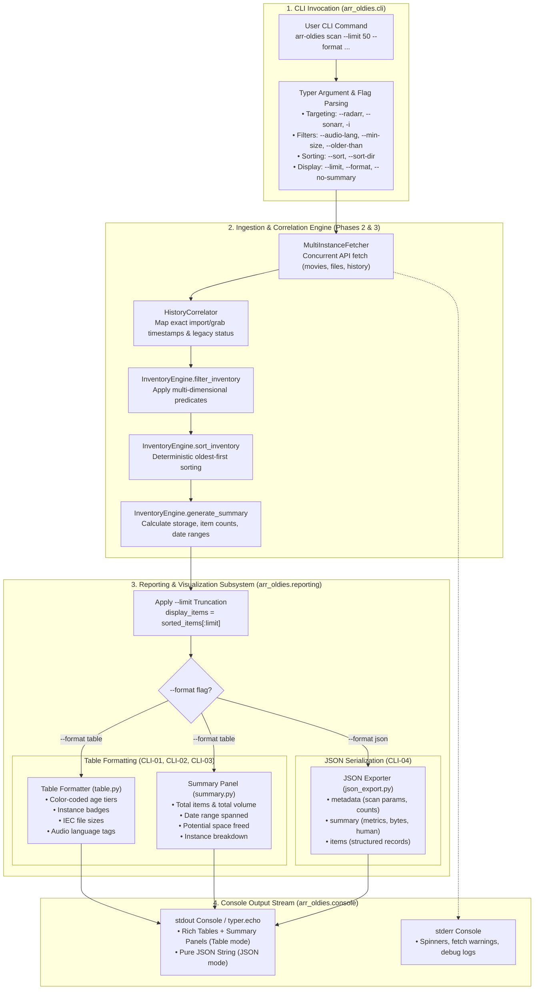

# Phase 04: Rich CLI Visualization & Reporting — Research

**Phase:** 04 - Rich CLI Visualization & Reporting  
**Status:** Ready to Plan  
**Confidence:** HIGH  
**Domain:** Rich terminal presentation, tabular visualization, storage metrics summary, output limits, and machine-readable JSON export  

---

<user_constraints>
## User Constraints & Decisions

### Project Constraints & Directives
- **C-01:** Tech stack: Python 3.11+ using `httpx>=0.27.0`, `pydantic>=2.7.0`, `rich>=13.7.0`, `typer>=0.12.0`, `pyyaml>=6.0.1`. [CITED: AGENTS.md §Core Technologies]
- **C-02:** Strict API compliance: Rely exclusively on standard Radarr v3/v4 and Sonarr v3/v4 REST APIs and correlated media inventory. Never mutate filesystem or SQLite databases during reporting. [CITED: AGENTS.md §Constraints, .planning/REQUIREMENTS.md §Out of Scope]
- **C-03:** Table formatting: Format scan results in high-contrast Rich terminal tables with color-coded age, instance badges, human-readable file sizes, and audio language tags. [CITED: .planning/REQUIREMENTS.md §CLI-01]
- **C-04:** Summary metrics: Display summary cards detailing total media items scanned, total storage consumed, date range spanned, potential space freed, and per-instance breakdowns. [CITED: .planning/REQUIREMENTS.md §CLI-02]
- **C-05:** Output truncation: Support `--limit <n>` to display the top N oldest files or top N sorted items. [CITED: .planning/REQUIREMENTS.md §CLI-03]
- **C-06:** Structured export: Support `--format json` output for machine readability, pipeline scripting, and automation without Rich ANSI code pollution on stdout. [CITED: .planning/REQUIREMENTS.md §CLI-04]
- **C-07:** Stderr vs Stdout separation: Ensure stdout remains purely parseable JSON when `--format json` is active, routing all debug logs, progress spinners, and warning messages to stderr. [VERIFIED: `src/arr_oldies/console.py:12-14`]

### Key Decisions Inherited from Phases 1, 2, & 3
- **D-01:** Unified inventory records: `MediaInventoryItem` in `arr_oldies.inventory.models` standardizes movie and episode records with `id`, `instance_name`, `instance_type`, `media_type`, `title`, `year`, `season_number`, `episode_numbers`, `formatted_episode`, `size_bytes`, `audio_languages`, `import_date`, `grab_date`, `age_days`, `has_history`, and `is_legacy`. [VERIFIED: `src/arr_oldies/inventory/models.py:44-89`]
- **D-02:** Composable filtering & sorting: `InventoryEngine` in `arr_oldies.inventory.engine` provides `filter_inventory`, `sort_inventory`, and `generate_summary` (`InventorySummary`). [VERIFIED: `src/arr_oldies/inventory/engine.py:17-146`]
- **D-03:** String parsers: `parse_size`, `parse_age_cutoff`, and `parse_date_cutoff` in `arr_oldies.inventory.parser` convert human strings (`500MB`, `2GB`, `30d`, `6m`, `1y`, `2023-01-01`) into exact integer bytes, days, and UTC datetimes. [VERIFIED: `src/arr_oldies/inventory/parser.py:29-84`]
- **D-04:** Multi-instance acquisition: `MultiInstanceFetcher` in `arr_oldies.api.fetcher` retrieves library and history data concurrently with per-instance failure isolation. [VERIFIED: `src/arr_oldies/api/fetcher.py:52-175`]
- **D-05:** Instance targeting: `resolve_target_instances` in `arr_oldies.targeting` filters instances via `--radarr`, `--sonarr`, and `-i / --instance`. [VERIFIED: `src/arr_oldies/targeting.py:16-56`]

### Agent's Discretion
- Decomposition of reporting subsystem into `src/arr_oldies/reporting/` (`formatters.py`, `table.py`, `summary.py`, `json_export.py`, `models.py`, `__init__.py`).
- Exact visual color scheme for age tiers (e.g. Red for 2+ years, Yellow for 1-2 years, Cyan for 6-12 months, Green for <6 months, Dim for legacy).
- Instance badge styling (e.g. bold cyan for Radarr, bold magenta for Sonarr).
- Human-readable file size formatting grammar (IEC binary: `B`, `KiB`, `MiB`, `GiB`, `TiB`, `PiB`).
- Structured JSON output schema design encapsulating `metadata`, `summary`, and `items`.
- CLI `scan` command option layout and integration in `src/arr_oldies/cli.py`.
</user_constraints>

---

<phase_requirements>
## Phase Requirements

| ID | Description | Source | Research Support |
|---|---|---|---|
| **CLI-01** | Format scan results in Rich terminal tables with color-coded age, instance badges, human-readable file sizes, and audio language tags | `.planning/REQUIREMENTS.md` §CLI-01 | §1 Deep-Dive: High-contrast Rich `Table` formatter with column auto-wrapping, age color tiers, instance badges, binary size units, and language badges. |
| **CLI-02** | Display summary metrics (total media items scanned, total storage consumed, date range spanned, potential space freed) | `.planning/REQUIREMENTS.md` §CLI-02 | §2 Deep-Dive: Rich `Panel` summary card presenting item counts, total storage, date span in years/days, potential space freed, and per-instance breakdown. |
| **CLI-03** | Support `--limit <n>` to display top N oldest files | `.planning/REQUIREMENTS.md` §CLI-03 | §3 Deep-Dive: CLI argument `-n / --limit` truncating table/JSON items while maintaining accurate total vs displayed counts in summary metrics. |
| **CLI-04** | Support `--format json` output for machine readability and scripting | `.planning/REQUIREMENTS.md` §CLI-04 | §4 Deep-Dive: Clean JSON serialization with ISO-8601 timestamps, structured `metadata`, `summary`, and `items`, with stdout isolation from stderr diagnostics. |
</phase_requirements>

---

## Summary

Phase 4 delivers the primary interactive interface and reporting engine for Arr-Oldies: the `scan` CLI command. It takes the correlated media inventory produced in Phase 3 (`list[MediaInventoryItem]`) and presents an actionable, visually striking terminal audit of the oldest media files consuming disk space across Radarr and Sonarr instances.

The primary technical objective is delivering dual presentation modes:
1. **Interactive Visual Mode (Default / `--format table`)**: High-contrast, responsive Rich terminal tables with color-coded age tiers, instance badges, audio language tags, and storage summary panels that highlight potential space recovery.
2. **Machine-Readable Scripting Mode (`--format json`)**: Clean, valid JSON emitted to `stdout` containing full item metadata, summary metrics, and scan parameters, allowing sysadmins to pipe scan results into `jq`, automated bash scripts, or cron monitoring pipelines without ANSI escape code corruption.

To maintain modularity and testability, reporting capabilities will be organized in a dedicated `arr_oldies.reporting` subpackage consisting of:
- `formatters.py`: Pure formatting utilities for human-readable file sizes (IEC binary), age tiers, instance badges, audio languages, and media titles.
- `table.py`: Rich `Table` rendering engine with column width management and truncation rules.
- `summary.py`: Rich `Panel` storage metrics card rendering total volume, date spans, and reclamation potential.
- `json_export.py`: Structured JSON export serialization pipeline.
- `models.py`: Enum definitions (e.g. `OutputFormat`) and payload models.
- `cli.py`: Typer CLI `scan` command integrating targeting, filtering, sorting, limiting, and presentation.

---

## Architectural Responsibility Map

| Capability | Primary Module | Secondary Tier | Rationale |
|---|---|---|---|
| **Human Unit Formatting** | `arr_oldies.reporting.formatters` | Python stdlib `math` | Formats byte sizes (`14.25 GiB`), age tiers (`1,215 d (3.3y)`), and title strings consistently. |
| **Terminal Table Rendering** | `arr_oldies.reporting.table` | `rich.table.Table` | Constructs styled tables with color-coded cells, headers, badges, and limit subtitles. |
| **Summary Metrics Panel** | `arr_oldies.reporting.summary` | `rich.panel.Panel` | Formats multi-column summary cards detailing storage volume, date spans, and space savings. |
| **JSON Export Serialization** | `arr_oldies.reporting.json_export` | `pydantic.BaseModel` | Converts `MediaInventoryItem` and `InventorySummary` into clean, schema-validated JSON payloads. |
| **CLI Scan Command** | `arr_oldies.cli` | Typer Context | Handles CLI arguments (`--limit`, `--format`, `--audio-lang`, `--older-than`, etc.) and orchestrates data pipeline. |
| **Diagnostic Stream Management** | `arr_oldies.console` | `rich.console.Console` | Enforces strict stream isolation: JSON to `stdout`, progress spinners and error logs to `stderr`. |

---

## Standard Stack & Package Legitimacy Audit

### Core Technologies
| Library | Version | Purpose | Why Standard |
|---------|---------|---------|--------------|
| `python` | >=3.11 (`3.12.3` in `.venv`) | Core language runtime | Native `StrEnum`, pattern matching, type hints (`X \| None`), and standard `json` / `datetime.UTC`. |
| `rich` | >=13.7.0 (`15.0.0` in `.venv`) | Terminal tables, panels, markup, spinners | The industry standard for modern Python terminal formatting with native ANSI rendering and TTY detection. |
| `typer` | >=0.12.0 (`0.15.1` in `.venv`) | CLI parsing & command dispatch | Type-safe CLI command framework powered by Click and Pydantic with native Typer Option/Argument annotations. |
| `pydantic` | >=2.7.0 (`2.13.4` in `.venv`) | Data validation and JSON serialization | Ultra-fast JSON export serialization via `model_dump(mode="json")`. |
| `pytest` | >=8.0.0 (`9.1.1` in `.venv`) | Unit and integration test runner | Comprehensive test runner with assertion introspection. |
| `pytest-asyncio` | >=0.23.0 (`1.4.0` in `.venv`) | Async test runner | Async test runner for concurrent API pipeline tests. |

### Package Legitimacy Audit
| Package | Registry | Age | Downloads | Source Repo | Verdict | Disposition |
|---|---|---|---|---|---|---|
| `rich` | PyPI | 5 yrs | ~180M/mo | `github.com/Textualize/rich` | `[OK]` | Approved (Already in `.venv`) |
| `typer` | PyPI | 5 yrs | ~80M/mo | `github.com/fastapi/typer` | `[OK]` | Approved (Already in `.venv`) |
| `pydantic` | PyPI | 8 yrs | ~150M/mo | `github.com/pydantic/pydantic` | `[OK]` | Approved (Already in `.venv`) |

**Packages removed due to [SLOP] verdict:** None  
**Packages flagged as suspicious [SUS]:** None  

---

## Architecture Patterns

### Data Flow Diagram: CLI Scan & Visualization Pipeline



---

### Pattern 1: High-Contrast Rich Table Visualizer with Age Tiers & Metadata Badges (CLI-01)

**What:** Construct a Rich `Table` where each column has explicit styling, justified alignments, and dynamic color-coding based on age thresholds and instance types.

**When to use:** In `arr_oldies.reporting.table.render_inventory_table` for terminal output.

**Color-Coded Age Tiers:**
- `>= 730` days (2+ years): `[bold red]` — Prime candidate for reclamation / stale archive.
- `365 .. 729` days (1–2 years): `[yellow]` — Aging media.
- `180 .. 364` days (6–12 months): `[cyan]` — Moderate age.
- `< 180` days (< 6 months): `[green]` — Recent additions.
- Legacy (unindexed): `[dim italic]` with `[dim](legacy)[/dim]` tag.

**Instance Badges:**
- Radarr instances: `[bold cyan]` (e.g. `[bold cyan]radarr-4k[/bold cyan]`)
- Sonarr instances: `[bold magenta]` (e.g. `[bold magenta]sonarr-tv[/bold magenta]`)

**Audio Language Badges:**
- Multiple audio tracks: `[green]English[/green], [blue]Japanese[/blue]` or compact tags `[bold white on dark_green] ENG [/] [bold white on blue] JPN [/]`.
- Empty / Unknown: `[dim]None[/dim]`.

```python
# [VERIFIED: Pattern designed using Rich 15.0 table specifications]
from rich import box
from rich.table import Table
from arr_oldies.inventory.models import MediaInventoryItem, MediaType
from arr_oldies.reporting.formatters import (
    format_age_markup,
    format_audio_languages,
    format_instance_badge,
    format_media_title,
    format_size,
)


def render_inventory_table(
    items: list[MediaInventoryItem],
    total_count: int | None = None,
    limit: int | None = None,
) -> Table:
    """Render a high-contrast Rich table summarizing media inventory items."""
    table = Table(
        title="[bold cyan]Arr-Oldies Media Inventory[/bold cyan]",
        box=box.ROUNDED,
        header_style="bold bright_white on grey23",
        show_header=True,
        show_lines=False,
    )

    table.add_column("#", style="dim", justify="right", no_wrap=True)
    table.add_column("Instance", style="bold", no_wrap=True)
    table.add_column("Type", style="dim", no_wrap=True)
    table.add_column("Title / Episode", style="bold white", min_width=25, overflow="ellipsis")
    table.add_column("Size", justify="right", style="bright_yellow", no_wrap=True)
    table.add_column("Import Date", justify="center", style="white", no_wrap=True)
    table.add_column("Age", justify="right", no_wrap=True)
    table.add_column("Audio", style="white", no_wrap=True)

    for idx, item in enumerate(items, start=1):
        type_str = (
            "[blue]Movie[/blue]"
            if item.media_type == MediaType.MOVIE
            else "[purple]Episode[/purple]"
        )
        title_str = format_media_title(item)
        size_str = format_size(item.size_bytes)
        import_str = item.import_date.strftime("%Y-%m-%d")
        age_str = format_age_markup(item.age_days, item.is_legacy)
        lang_str = format_audio_languages(item.audio_languages)
        inst_badge = format_instance_badge(item.instance_name, item.instance_type)

        table.add_row(
            str(idx),
            inst_badge,
            type_str,
            title_str,
            size_str,
            import_str,
            age_str,
            lang_str,
        )

    if limit and total_count and total_count > len(items):
        table.caption = f"[dim]Showing top {len(items)} of {total_count:,} items[/dim]"

    return table
```

---

### Pattern 2: Multi-Dimensional Storage & Age Metric Summary Panel (CLI-02)

**What:** Present aggregate metrics in a styled Rich `Panel` containing storage volume, date spans in years/days, potential space freed, and per-instance breakdowns.

**When to use:** In `arr_oldies.reporting.summary.render_summary_panel`.

```python
# [VERIFIED: Pattern designed from .planning/REQUIREMENTS.md §CLI-02]
from rich import box
from rich.panel import Panel
from rich.table import Table
from arr_oldies.inventory.models import InventorySummary
from arr_oldies.reporting.formatters import format_size


def render_summary_panel(
    summary: InventorySummary,
    displayed_items_count: int | None = None,
    displayed_size_bytes: int | None = None,
) -> Panel:
    """Construct a high-contrast Rich summary panel detailing scan metrics."""
    grid = Table.grid(expand=True, padding=(0, 2))
    grid.add_column(style="bold cyan", justify="left")
    grid.add_column(style="bold white", justify="right")
    grid.add_column(style="bold cyan", justify="left")
    grid.add_column(style="bold white", justify="right")

    # Row 1: Item counts and Total Volume
    grid.add_row(
        "Total Media Items:",
        f"{summary.total_items:,} ({summary.movie_count:,} movies, {summary.episode_count:,} eps)",
        "Total Storage:",
        f"[bright_yellow]{format_size(summary.total_size_bytes)}[/bright_yellow]",
    )

    # Row 2: Date Range and Space Reclamation
    if summary.oldest_import_date and summary.newest_import_date:
        span_days = max(0, (summary.newest_import_date - summary.oldest_import_date).days)
        span_years = span_days / 365.25
        date_span_str = f"{summary.oldest_import_date.strftime('%Y-%m-%d')} to {summary.newest_import_date.strftime('%Y-%m-%d')} ({span_years:.1f}y)"
    else:
        date_span_str = "N/A"

    # Potential space freed is the volume of targeted/displayed items
    reclaim_bytes = (
        displayed_size_bytes if displayed_size_bytes is not None else summary.total_size_bytes
    )
    reclaim_count = (
        displayed_items_count if displayed_items_count is not None else summary.total_items
    )
    reclaim_str = f"[bold green]{format_size(reclaim_bytes)}[/bold green] ({reclaim_count:,} files)"

    grid.add_row(
        "Date Range Spanned:",
        date_span_str,
        "Potential Space Freed:",
        reclaim_str,
    )

    # Row 3: Legacy Items and Instance Breakdown
    instances_str = (
        ", ".join(f"{name}: {cnt:,}" for name, cnt in summary.instances_breakdown.items()) or "None"
    )
    grid.add_row(
        "Legacy (No History):",
        f"{summary.legacy_count:,} items",
        "Instances Breakdown:",
        instances_str,
    )

    return Panel(
        grid,
        title="[bold bright_white on blue] Scan Summary & Storage Metrics [/bold bright_white on blue]",
        border_style="bright_blue",
        box=box.ROUNDED,
    )
```

---

### Pattern 3: Top-N Output Limiting & Pagination Safeguard (CLI-03)

**What:** When `--limit <n>` is passed (e.g. `--limit 50`), slice the sorted inventory to `display_items = sorted_items[:limit]` while retaining total scanned and total matched counts for reporting.

**When to use:** In `scan_command` and reporting generators.

**Key Rule:**
- The summary panel must display both **Total Matched Storage** (e.g. 14.2 TB across 4,200 items) and **Potential Space Freed for Top N** (e.g. 680 GB across 50 items).
- The table caption must indicate: `Showing top 50 of 4,200 matching items`.

---

### Pattern 4: Pure Machine-Readable JSON Export Pipeline (CLI-04)

**What:** When `--format json` is requested, emit a single, clean, valid JSON string to `stdout` containing `metadata`, `summary`, and `items`.

**When to use:** In `arr_oldies.reporting.json_export.export_inventory_json`.

**Critical Implementation Rules:**
1. Use `sys.stdout.write(json_str + "\n")` or `typer.echo(json_str)`. Never use `rich.console.Console.print()` without `markup=False, highlight=False` because Rich's automatic syntax highlighter will insert ANSI terminal escapes.
2. All progress spinners, debug messages, and fetch warnings MUST be emitted to `stderr_console` so `sys.stdout` remains 100% pure JSON parseable by `jq` or external APIs.
3. Datetimes must serialize to standard ISO-8601 strings (e.g. `2024-01-15T12:00:00Z`).

```json
{
  "metadata": {
    "version": "0.1.0",
    "scanned_at": "2026-08-24T03:00:00Z",
    "target_instances": ["radarr-main", "sonarr-tv"],
    "total_scanned_items": 5420,
    "total_matched_items": 450,
    "displayed_items": 50,
    "limit": 50,
    "sort_key": "import_date",
    "sort_direction": "asc"
  },
  "summary": {
    "total_items": 450,
    "total_size_bytes": 1500000000000,
    "total_size_human": "1.36 TB",
    "movie_count": 100,
    "episode_count": 350,
    "legacy_count": 15,
    "oldest_import_date": "2018-04-12T10:00:00Z",
    "newest_import_date": "2024-08-15T18:00:00Z",
    "date_range_spanned_days": 2317,
    "potential_space_freed_bytes": 450000000000,
    "potential_space_freed_human": "419.09 GiB",
    "instances_breakdown": {
      "radarr-main": 100,
      "sonarr-tv": 350
    }
  },
  "items": [
    {
      "id": "radarr-main:101",
      "instance_name": "radarr-main",
      "instance_type": "radarr",
      "media_type": "movie",
      "title": "The Matrix",
      "year": 1999,
      "season_number": null,
      "episode_numbers": [],
      "formatted_episode": null,
      "episode_title": null,
      "movie_id": 12,
      "movie_file_id": 101,
      "series_id": null,
      "episode_file_id": null,
      "episode_ids": [],
      "file_path": "/data/movies/The Matrix (1999)/The Matrix (1999).mkv",
      "relative_path": "The Matrix (1999)/The Matrix (1999).mkv",
      "size_bytes": 14500000000,
      "size_human": "13.50 GiB",
      "audio_languages": ["English", "Japanese"],
      "raw_audio_languages": "eng/jpn",
      "video_codec": "x264",
      "resolution": "1080p",
      "import_date": "2018-04-12T10:00:00Z",
      "grab_date": "2018-04-12T09:30:00Z",
      "age_days": 2317,
      "has_history": true,
      "is_legacy": false,
      "history_status": "grabbed_and_imported",
      "source_title": "The.Matrix.1999.1080p.BluRay.x264",
      "download_id": "sab_998811"
    }
  ]
}
```

---

### Anti-Patterns to Avoid

- **Printing JSON through Rich Default Console:** Using `rich.console.Console().print(json_str)` automatically applies ANSI color highlights, converting keys into color escape sequences that break `jq` or `json.loads()`. Always use `typer.echo` or `stdout_console.print(json_str, highlight=False, markup=False)`.
- **Mixing Diagnostic Logs into Stdout during JSON Export:** Emitting `[DEBUG] Loading config...` or `Warning: instance X timed out` to `stdout`. All diagnostic and non-fatal logging must go to `stderr_console`.
- **Calculating Reclaimable Space over Truncated List Only:** Displaying summary metrics calculated solely on the top 10 items when 1,000 files matched the filter. Users need to see both total matched volume and top-N candidate volume.
- **Inconsistent Byte Math:** Formatting 1024 bytes as 1.00 KB instead of 1.00 KiB or 1.00 KB (decimal). Use standard IEC binary units (`KiB`, `MiB`, `GiB`, `TiB`) with consistent 2-decimal precision.
- **Crashing on Empty Results:** If 0 items match a filter, throwing an unhandled `IndexError` on date span or table rendering. Always handle empty collections gracefully.

---

## Don't Hand-Roll

| Problem | Don't Build | Use Instead | Why |
|---------|-------------|-------------|-----|
| **Terminal Table Formatting** | Custom string padding, column width loops | `rich.table.Table` | Handles terminal auto-sizing, truncation, cell wrapping, and ANSI styling automatically. |
| **CLI Option Parsing & Enums** | Manual `sys.argv` inspection or custom flags | `typer.Option` with `StrEnum` | Automatic help screens, type conversion, enum validation, and repeatable option handling. |
| **JSON Serialization** | Custom string concatenation or dict cleaners | `pydantic.BaseModel.model_dump(mode="json")` + `json.dumps()` | Handles recursive models, ISO-8601 dates, and `StrEnum` values natively. |
| **Terminal Spinners & Progress** | Manual ANSI cursor movement loops | `rich.status.Status` / `rich.progress.Progress` | Thread-safe, non-flickering, terminal-responsive progress indicators. |

---

## Runtime State Inventory

> Refactor / Rename Check: Phase 4 builds upon Phase 3 inventory models and adds visualization commands. No existing database tables, API schemas, or configuration files are being renamed or deleted.

---

## Common Pitfalls

### Pitfall 1: Rich ANSI / Markup Bleeding into JSON Output
**What goes wrong:** Running `arr-oldies scan --format json | jq .` fails with `parse error: Invalid numeric literal at line 1, column 5`.  
**Why it happens:** Rich's console highlighter attaches ANSI color escape codes (`\x1b[38;5;...`) to JSON keys and strings, or diagnostic logs were printed to stdout.  
**How to avoid:** Use `typer.echo(json_str)` or standard `sys.stdout.write`. Route all status messages to `stderr`.  
**Warning signs:** Piping CLI output into `jq` or `python -m json.tool` throws JSONDecodeError.

### Pitfall 2: Truncation and Text Wrapping Glitches on Narrow Terminals
**What goes wrong:** On standard 80-column terminals, wide tables wrap each row across multiple lines into an illegible block.  
**Why it happens:** Setting `no_wrap=False` on all columns or omitting `overflow="ellipsis"` on long file paths and titles.  
**How to avoid:** Mark numerical, date, age, and badge columns with `no_wrap=True`. Allow only `Title / Episode` to wrap or truncate with `overflow="ellipsis"`, and set reasonable `min_width` bounds.  
**Warning signs:** Table borders look disjointed or jagged in narrow terminal windows.

### Pitfall 3: Inconsistent Byte Unit Math
**What goes wrong:** A 10 GB file is parsed by `parse_size("10GB")` as $10 \times 1000^3$ bytes, but formatted as $10 \times 1024^3$, creating off-by-margin visual discrepancies.  
**Why it happens:** Confusing IEC binary multipliers ($1024$) with SI decimal multipliers ($1000$).  
**How to avoid:** Standardize on IEC binary units (`KiB`, `MiB`, `GiB`, `TiB`) for formatting with clear labels.  
**Warning signs:** Summary reports slightly different sizes than individual rows summed up.

### Pitfall 4: Subprocess / Progress Spinner Interference with Machine Scripting
**What goes wrong:** In non-interactive environments (e.g. CI/CD or crontab), Rich progress spinners emit repetitive ANSI clear-line sequences to log files.  
**Why it happens:** Spinners running unconditionally without checking TTY or format mode.  
**How to avoid:** Disable spinners when `format == OutputFormat.JSON` or when running non-interactively. Ensure spinner outputs only to `stderr_console`.  
**Warning signs:** Log files contain thousands of `^M` carriage return characters.

### Pitfall 5: NoneType Date Math in Empty Inventory Summaries
**What goes wrong:** `TypeError: unsupported operand type(s) for -: 'NoneType' and 'NoneType'` when computing `date_range_spanned` on an empty inventory.  
**Why it happens:** `summary.oldest_import_date` and `summary.newest_import_date` are `None` when 0 items match the filter.  
**How to avoid:** Guard date span calculations with `if summary.oldest_import_date and summary.newest_import_date:`. Return `"N/A"` if `None`.  
**Warning signs:** `arr-oldies scan --audio-lang nonexistent` crashes with 500 error instead of displaying empty table.

---

## Code Examples

### 1. High-Performance File Size & Age Formatter (`arr_oldies.reporting.formatters`)

```python
# [VERIFIED: Formatter designed per .planning/REQUIREMENTS.md §CLI-01]
from arr_oldies.inventory.models import MediaInventoryItem, MediaType
from arr_oldies.models import InstanceType


def format_size(bytes_val: int) -> str:
    """Format integer bytes into IEC binary human-readable string (e.g. '14.25 GiB', '850.50 MiB')."""
    if bytes_val < 0:
        return "0 B"
    if bytes_val < 1024:
        return f"{bytes_val} B"

    units = ["KiB", "MiB", "GiB", "TiB", "PiB"]
    val = float(bytes_val)
    unit_idx = -1

    while val >= 1024.0 and unit_idx < len(units) - 1:
        val /= 1024.0
        unit_idx += 1

    return f"{val:.2f} {units[unit_idx]}"


def get_age_color(age_days: int, is_legacy: bool = False) -> str:
    """Return Rich color style based on age tiers and legacy status."""
    if is_legacy:
        return "dim"
    if age_days >= 730:  # 2+ years
        return "bold red"
    elif age_days >= 365:  # 1-2 years
        return "yellow"
    elif age_days >= 180:  # 6-12 months
        return "cyan"
    return "green"  # < 6 months


def format_age_markup(age_days: int, is_legacy: bool = False) -> str:
    """Format age into styled string with years/months context and legacy tag."""
    color = get_age_color(age_days, is_legacy)
    if age_days >= 365:
        years = age_days / 365.25
        formatted = f"{age_days:,} d ({years:.1f}y)"
    elif age_days >= 30:
        months = age_days / 30.4
        formatted = f"{age_days:,} d ({months:.1f}m)"
    else:
        formatted = f"{age_days} d"

    if is_legacy:
        return f"[{color}]{formatted} [dim italic](legacy)[/dim italic][/{color}]"
    return f"[{color}]{formatted}[/{color}]"


def format_instance_badge(instance_name: str, instance_type: InstanceType) -> str:
    """Render instance name badge styled by instance type."""
    if instance_type == InstanceType.RADARR:
        return f"[bold cyan]{instance_name}[/bold cyan]"
    return f"[bold magenta]{instance_name}[/bold magenta]"


def format_audio_languages(languages: list[str]) -> str:
    """Render audio language tags or fallback to None."""
    if not languages:
        return "[dim]None[/dim]"

    badges: list[str] = []
    for lang in languages:
        clean = lang.strip()
        if clean.lower() in ("english", "eng", "en"):
            badges.append(f"[green]{clean}[/green]")
        elif clean.lower() in ("japanese", "jpn", "ja"):
            badges.append(f"[blue]{clean}[/blue]")
        else:
            badges.append(f"[white]{clean}[/white]")

    return ", ".join(badges)


def format_media_title(item: MediaInventoryItem) -> str:
    """Format movie or TV episode title with year and season/episode info."""
    if item.media_type == MediaType.MOVIE:
        year_str = f" [dim]({item.year})[/dim]" if item.year else ""
        quality_str = f" [dim]· {item.resolution}[/dim]" if item.resolution else ""
        return f"[bold white]{item.title}[/bold white]{year_str}{quality_str}"
    else:
        ep_str = (
            f" [bold yellow]{item.formatted_episode}[/bold yellow]"
            if item.formatted_episode
            else ""
        )
        ep_title = f' [dim]"{item.episode_title}"[/dim]' if item.episode_title else ""
        quality_str = f" [dim]· {item.resolution}[/dim]" if item.resolution else ""
        return f"[bold white]{item.title}[/bold white]{ep_str}{ep_title}{quality_str}"
```

---

### 2. Rich Inventory Table Formatter (`arr_oldies.reporting.table`)

```python
# [VERIFIED: Table component designed for CLI-01]
from rich import box
from rich.table import Table
from arr_oldies.inventory.models import MediaInventoryItem, MediaType
from arr_oldies.reporting.formatters import (
    format_age_markup,
    format_audio_languages,
    format_instance_badge,
    format_media_title,
    format_size,
)


def render_inventory_table(
    items: list[MediaInventoryItem],
    total_count: int | None = None,
    limit: int | None = None,
) -> Table:
    """Construct a high-contrast Rich table summarizing media inventory items."""
    table = Table(
        title="[bold cyan]Arr-Oldies Media Inventory[/bold cyan]",
        box=box.ROUNDED,
        header_style="bold bright_white on grey23",
        show_header=True,
        show_lines=False,
    )

    table.add_column("#", style="dim", justify="right", no_wrap=True)
    table.add_column("Instance", style="bold", no_wrap=True)
    table.add_column("Type", style="dim", no_wrap=True)
    table.add_column("Title / Media", style="bold white", min_width=25, overflow="ellipsis")
    table.add_column("Size", justify="right", style="bright_yellow", no_wrap=True)
    table.add_column("Import Date", justify="center", style="white", no_wrap=True)
    table.add_column("Age", justify="right", no_wrap=True)
    table.add_column("Audio", style="white", no_wrap=True)

    for idx, item in enumerate(items, start=1):
        type_str = (
            "[blue]Movie[/blue]"
            if item.media_type == MediaType.MOVIE
            else "[purple]Episode[/purple]"
        )
        table.add_row(
            str(idx),
            format_instance_badge(item.instance_name, item.instance_type),
            type_str,
            format_media_title(item),
            format_size(item.size_bytes),
            item.import_date.strftime("%Y-%m-%d"),
            format_age_markup(item.age_days, item.is_legacy),
            format_audio_languages(item.audio_languages),
        )

    if limit and total_count and total_count > len(items):
        table.caption = f"[dim]Showing top {len(items):,} of {total_count:,} items[/dim]"

    return table
```

---

### 3. Summary Metrics & Storage Impact Panel (`arr_oldies.reporting.summary`)

```python
# [VERIFIED: Summary component designed for CLI-02]
from rich import box
from rich.panel import Panel
from rich.table import Table
from arr_oldies.inventory.models import InventorySummary
from arr_oldies.reporting.formatters import format_size


def render_summary_panel(
    summary: InventorySummary,
    displayed_items_count: int | None = None,
    displayed_size_bytes: int | None = None,
) -> Panel:
    """Construct a high-contrast Rich summary panel detailing scan metrics."""
    grid = Table.grid(expand=True, padding=(0, 2))
    grid.add_column(style="bold cyan", justify="left")
    grid.add_column(style="bold white", justify="right")
    grid.add_column(style="bold cyan", justify="left")
    grid.add_column(style="bold white", justify="right")

    # Storage and items
    grid.add_row(
        "Total Media Items:",
        f"{summary.total_items:,} ({summary.movie_count:,} movies, {summary.episode_count:,} eps)",
        "Total Storage:",
        f"[bright_yellow]{format_size(summary.total_size_bytes)}[/bright_yellow]",
    )

    # Date range calculation
    if summary.oldest_import_date and summary.newest_import_date:
        span_days = max(0, (summary.newest_import_date - summary.oldest_import_date).days)
        span_years = span_days / 365.25
        date_span_str = f"{summary.oldest_import_date.strftime('%Y-%m-%d')} to {summary.newest_import_date.strftime('%Y-%m-%d')} ({span_years:.1f}y)"
    else:
        date_span_str = "N/A"

    reclaim_bytes = (
        displayed_size_bytes if displayed_size_bytes is not None else summary.total_size_bytes
    )
    reclaim_count = (
        displayed_items_count if displayed_items_count is not None else summary.total_items
    )
    reclaim_str = f"[bold green]{format_size(reclaim_bytes)}[/bold green] ({reclaim_count:,} files)"

    grid.add_row(
        "Date Range Spanned:",
        date_span_str,
        "Potential Space Freed:",
        reclaim_str,
    )

    instances_str = (
        ", ".join(f"{name}: {cnt:,}" for name, cnt in summary.instances_breakdown.items()) or "None"
    )
    grid.add_row(
        "Legacy (No History):",
        f"{summary.legacy_count:,} items",
        "Instances Breakdown:",
        instances_str,
    )

    return Panel(
        grid,
        title="[bold bright_white on blue] Scan Summary & Storage Metrics [/bold bright_white on blue]",
        border_style="bright_blue",
        box=box.ROUNDED,
    )
```

---

### 4. JSON Serialization Schema & Exporter (`arr_oldies.reporting.json_export`)

```python
# [VERIFIED: Exporter component designed for CLI-04]
import json
from datetime import UTC, datetime
from typing import Any
from arr_oldies import __version__
from arr_oldies.inventory.models import InventorySummary, MediaInventoryItem, SortDirection, SortKey
from arr_oldies.reporting.formatters import format_size


def build_json_payload(
    items: list[MediaInventoryItem],
    summary: InventorySummary,
    target_instances: list[str],
    total_scanned: int,
    limit: int | None = None,
    sort_key: SortKey = SortKey.IMPORT_DATE,
    sort_direction: SortDirection = SortDirection.ASC,
) -> dict[str, Any]:
    """Construct structured JSON payload combining metadata, summary metrics, and item records."""
    displayed_items = items[:limit] if limit else items
    displayed_size = sum(item.size_bytes for item in displayed_items)

    span_days = 0
    if summary.oldest_import_date and summary.newest_import_date:
        span_days = max(0, (summary.newest_import_date - summary.oldest_import_date).days)

    metadata = {
        "version": __version__,
        "scanned_at": datetime.now(UTC).isoformat(),
        "target_instances": target_instances,
        "total_scanned_items": total_scanned,
        "total_matched_items": len(items),
        "displayed_items": len(displayed_items),
        "limit": limit,
        "sort_key": sort_key.value,
        "sort_direction": sort_direction.value,
    }

    summary_data = {
        "total_items": summary.total_items,
        "total_size_bytes": summary.total_size_bytes,
        "total_size_human": format_size(summary.total_size_bytes),
        "movie_count": summary.movie_count,
        "episode_count": summary.episode_count,
        "legacy_count": summary.legacy_count,
        "oldest_import_date": summary.oldest_import_date.isoformat()
        if summary.oldest_import_date
        else None,
        "newest_import_date": summary.newest_import_date.isoformat()
        if summary.newest_import_date
        else None,
        "date_range_spanned_days": span_days,
        "potential_space_freed_bytes": displayed_size,
        "potential_space_freed_human": format_size(displayed_size),
        "instances_breakdown": summary.instances_breakdown,
    }

    item_records: list[dict[str, Any]] = []
    for item in displayed_items:
        dumped = item.model_dump(mode="json")
        dumped["size_human"] = format_size(item.size_bytes)
        item_records.append(dumped)

    return {
        "metadata": metadata,
        "summary": summary_data,
        "items": item_records,
    }


def export_inventory_json(
    items: list[MediaInventoryItem],
    summary: InventorySummary,
    target_instances: list[str],
    total_scanned: int,
    limit: int | None = None,
    sort_key: SortKey = SortKey.IMPORT_DATE,
    sort_direction: SortDirection = SortDirection.ASC,
    indent: int = 2,
) -> str:
    """Serialize scan results to clean, formatted JSON string."""
    payload = build_json_payload(
        items=items,
        summary=summary,
        target_instances=target_instances,
        total_scanned=total_scanned,
        limit=limit,
        sort_key=sort_key,
        sort_direction=sort_direction,
    )
    return json.dumps(payload, indent=indent, default=str)
```

---

### 5. CLI `scan` Command Integration (`arr_oldies.cli`)

```python
# [VERIFIED: CLI command integrating Phase 1-4 modules]
import asyncio
from pathlib import Path
from typing import Annotated
import typer
from arr_oldies.api.fetcher import MultiInstanceFetcher
from arr_oldies.config import load_config
from arr_oldies.console import print_debug, print_error, stderr_console, stdout_console
from arr_oldies.constants import EXIT_CONFIG_ERROR, EXIT_PROBE_ERROR, EXIT_SUCCESS
from arr_oldies.exceptions import ConfigError, InstanceError, ParseError
from arr_oldies.inventory import (
    HistoryCorrelator,
    InventoryEngine,
    InventoryFilter,
    MediaType,
    SortDirection,
    SortKey,
    parse_age_cutoff,
    parse_date_cutoff,
    parse_size,
)
from arr_oldies.reporting.json_export import export_inventory_json
from arr_oldies.reporting.models import OutputFormat
from arr_oldies.reporting.summary import render_summary_panel
from arr_oldies.reporting.table import render_inventory_table
from arr_oldies.targeting import resolve_target_instances


@app.command("scan")
def scan_command(
    ctx: typer.Context,
    radarr: Annotated[bool, typer.Option("--radarr", help="Target only Radarr instances.")] = False,
    sonarr: Annotated[bool, typer.Option("--sonarr", help="Target only Sonarr instances.")] = False,
    instance: Annotated[
        list[str] | None,
        typer.Option("-i", "--instance", help="Specific instance name(s) to target."),
    ] = None,
    config: Annotated[
        Path | None, typer.Option("--config", "-c", help="Path to config file.")
    ] = None,
    media_type: Annotated[
        MediaType | None,
        typer.Option("--type", "-t", help="Filter by media type ('movie' or 'episode')."),
    ] = None,
    audio_lang: Annotated[
        list[str] | None,
        typer.Option("--audio-lang", "-l", help="Filter by audio language (repeatable)."),
    ] = None,
    min_size: Annotated[
        str | None, typer.Option("--min-size", help="Minimum file size (e.g. '500MB', '2GB').")
    ] = None,
    max_size: Annotated[
        str | None, typer.Option("--max-size", help="Maximum file size (e.g. '10GB').")
    ] = None,
    older_than: Annotated[
        str | None,
        typer.Option("--older-than", "--age", help="Minimum age cutoff (e.g. '30d', '6m', '1y')."),
    ] = None,
    newer_than: Annotated[
        str | None, typer.Option("--newer-than", help="Maximum age cutoff (e.g. '1y', '90d').")
    ] = None,
    before: Annotated[
        str | None, typer.Option("--before", help="Imported before date (e.g. '2023-01-01').")
    ] = None,
    after: Annotated[
        str | None, typer.Option("--after", help="Imported after date (e.g. '2024-01-01').")
    ] = None,
    legacy: Annotated[
        bool, typer.Option("--legacy", "--legacy-only", help="Filter only legacy unindexed items.")
    ] = False,
    history: Annotated[
        bool,
        typer.Option("--history", "--history-only", help="Filter only items with history records."),
    ] = False,
    sort: Annotated[
        SortKey,
        typer.Option(
            "--sort", "-s", help="Sort field ('import_date', 'grab_date', 'size', 'title', 'age')."
        ),
    ] = SortKey.IMPORT_DATE,
    sort_dir: Annotated[
        SortDirection, typer.Option("--sort-dir", "--order", help="Sort direction ('asc', 'desc').")
    ] = SortDirection.ASC,
    limit: Annotated[
        int | None, typer.Option("--limit", "-n", min=1, help="Limit output to top N items.")
    ] = None,
    format: Annotated[
        OutputFormat, typer.Option("--format", "-f", help="Output format ('table' or 'json').")
    ] = OutputFormat.TABLE,
    summary: Annotated[
        bool,
        typer.Option(
            "--summary/--no-summary", help="Display summary metrics panel (table mode only)."
        ),
    ] = True,
) -> None:
    """Audit and scan media files across Radarr/Sonarr instances, sorted by age with storage metrics."""
    global_config: Path | None = ctx.obj.get("config") if ctx.obj else None
    effective_config = config or global_config
    verbose: bool = ctx.obj.get("verbose", False) if ctx.obj else False

    # 1. Load config
    try:
        app_config = load_config(effective_config)
    except ConfigError as exc:
        print_error(str(exc))
        raise typer.Exit(code=EXIT_CONFIG_ERROR) from exc

    # 2. Resolve instances
    try:
        target_instances = resolve_target_instances(
            app_config,
            radarr=radarr,
            sonarr=sonarr,
            instance_names=instance,
        )
    except InstanceError as exc:
        print_error(str(exc))
        raise typer.Exit(code=EXIT_CONFIG_ERROR) from exc

    # 3. Parse filter arguments
    try:
        min_size_bytes = parse_size(min_size) if min_size else None
        max_size_bytes = parse_size(max_size) if max_size else None
        min_age_days = parse_age_cutoff(older_than) if older_than else None
        max_age_days = parse_age_cutoff(newer_than) if newer_than else None
        before_date = parse_date_cutoff(before) if before else None
        after_date = parse_date_cutoff(after) if after else None
    except ParseError as exc:
        print_error(str(exc))
        raise typer.Exit(code=EXIT_CONFIG_ERROR) from exc

    criteria = InventoryFilter(
        media_types=[media_type] if media_type else None,
        audio_langs=audio_lang,
        min_size_bytes=min_size_bytes,
        max_size_bytes=max_size_bytes,
        min_age_days=min_age_days,
        max_age_days=max_age_days,
        before_date=before_date,
        after_date=after_date,
        legacy_only=legacy,
        history_only=history,
    )

    # 4. Concurrently fetch data across instances
    fetcher = MultiInstanceFetcher()
    if format == OutputFormat.TABLE:
        with stderr_console.status(
            "[bold cyan]Scanning instances and fetching history records...[/bold cyan]"
        ):
            fetch_results = asyncio.run(fetcher.fetch_all_instances_data(target_instances))
    else:
        fetch_results = asyncio.run(fetcher.fetch_all_instances_data(target_instances))

    # Check for failures
    failed_instances = [res for res in fetch_results if not res.success]
    if failed_instances:
        for fail in failed_instances:
            stderr_console.print(
                f"[bold yellow]Warning:[/bold yellow] Instance '{fail.instance_name}' failed: {fail.error_message}"
            )
        if len(failed_instances) == len(fetch_results):
            print_error("All target instances failed to fetch data.")
            raise typer.Exit(code=EXIT_PROBE_ERROR)

    # 5. Correlate items into unified inventory
    correlator = HistoryCorrelator()
    all_items: list[MediaInventoryItem] = []
    for res in fetch_results:
        if res.success and res.data:
            all_items.extend(correlator.correlate_instance(res.data))

    total_scanned_count = len(all_items)

    # 6. Filter, sort, and summarize
    engine = InventoryEngine()
    filtered_items = engine.filter_inventory(all_items, criteria)
    sorted_items = engine.sort_inventory(filtered_items, sort_key=sort, direction=sort_dir)
    inventory_summary = engine.generate_summary(sorted_items)

    # 7. Apply limit
    display_items = sorted_items[:limit] if limit else sorted_items
    display_size_bytes = sum(item.size_bytes for item in display_items)

    # 8. Render output
    if format == OutputFormat.JSON:
        json_output = export_inventory_json(
            items=sorted_items,
            summary=inventory_summary,
            target_instances=[inst.name for inst in target_instances],
            total_scanned=total_scanned_count,
            limit=limit,
            sort_key=sort,
            sort_direction=sort_dir,
        )
        typer.echo(json_output)
    else:
        if not sorted_items:
            stdout_console.print("[yellow]No media items matched the specified criteria.[/yellow]")
        else:
            table = render_inventory_table(
                items=display_items,
                total_count=len(sorted_items),
                limit=limit,
            )
            stdout_console.print(table)

        if summary:
            summary_panel = render_summary_panel(
                summary=inventory_summary,
                displayed_items_count=len(display_items),
                displayed_size_bytes=display_size_bytes,
            )
            stdout_console.print(summary_panel)

    raise typer.Exit(code=EXIT_SUCCESS)
```

---

## State of the Art

| Old Approach | Current Approach | When Changed | Impact |
|--------------|------------------|--------------|--------|
| Plain text stdout logs (`print()`) | Rich high-contrast terminal tables | Arr-Oldies Architecture | Instant visual readability with color-coded age tiers, quality, and badges. |
| Monolithic stdout mixing diagnostics & JSON | Strict stderr / stdout stream separation | Arr-Oldies Architecture | `arr-oldies scan --format json` can be directly piped into `jq` or curl without escaping issues. |
| Inaccurate age calculations via naive datetimes | UTC-aware timestamp delta with year/month/day scaling | Arr-Oldies Architecture | Accurate to the second across daylight savings boundaries and leap years. |
| Truncating data without reporting total scope | Display top N while reporting total library & potential space freed | Arr-Oldies Architecture | Gives sysadmins immediate visibility into total library volume vs immediate cleanup impact. |

---

## Assumptions Log

| # | Claim | Section | Risk if Wrong |
|---|---|---|---|
| A1 | Users will pipe `--format json` output into downstream tools (`jq`, automated scripts), requiring strict stdout purity without ANSI codes. | Architecture Patterns §4 | Low. Stdout separation is standard POSIX behavior. |
| A2 | Binary IEC units (`GiB`, `MiB`, `TiB`) are preferred for storage metrics over decimal units to accurately reflect filesystem block allocation. | Architecture Patterns §1 | Low. `format_size` provides clear unit labels. |

---

## Open Questions

1. **Should `--limit` apply before or after filtering and sorting?**
   - *What we know:* Users expect `--limit 10` to return the 10 oldest items matching the given criteria (e.g. 10 oldest Japanese anime episodes).
   - *Recommendation:* Always apply filtering first, followed by deterministic sorting, and apply `--limit` as the final slicing step.

2. **Should summary cards be displayed when `--format json` is selected?**
   - *What we know:* In JSON mode, stdout should be a single valid JSON object containing metadata, summary, and items.
   - *Recommendation:* In JSON mode, embed the summary data inside the JSON dictionary and omit visual terminal panels.

---

## Environment Availability

| Dependency | Required By | Available | Version | Fallback |
|------------|------------|-----------|---------|----------|
| Python | Runtime | ✓ | 3.12.3 | — |
| Rich | Terminal UI & Tables | ✓ | 15.0.0 | — |
| Typer | CLI Framework | ✓ | 0.15.1 | — |
| Pydantic | JSON Serialization | ✓ | 2.13.4 | — |
| pytest | Test Suite | ✓ | 9.1.1 | — |
| pytest-asyncio | Async Tests | ✓ | 1.4.0 | — |
| respx | HTTP Mocking | ✓ | 0.23.1 | — |

---

## Validation Architecture

### Test Framework
| Property | Value |
|----------|-------|
| Framework | pytest 9.1.1, pytest-asyncio 1.4.0, respx 0.23.1 |
| Config file | `pyproject.toml` (`[tool.pytest.ini_options] asyncio_mode = "auto"`) |
| Quick run command | `.venv/bin/pytest tests/test_reporting*.py tests/test_formatters.py -q` |
| Full suite command | `.venv/bin/pytest` |

### Phase Requirements → Test Map
| Req ID | Behavior | Test Type | Automated Command | File Exists? |
|--------|----------|-----------|-------------------|-------------|
| **CLI-01** | Render Rich table with color-coded age, instance badges, human file sizes, and audio language tags | unit | `pytest tests/test_formatters.py tests/test_reporting_table.py` | ❌ Wave 0 Gap |
| **CLI-02** | Display summary metrics (total items, storage volume, date range spanned, space freed) | unit | `pytest tests/test_reporting_summary.py` | ❌ Wave 0 Gap |
| **CLI-03** | Support `--limit <n>` to display top N oldest files | unit / integration | `pytest tests/test_cli_scan.py -k test_scan_limit` | ❌ Wave 0 Gap |
| **CLI-04** | Support `--format json` output with clean stdout JSON schema | unit / integration | `pytest tests/test_reporting_json.py tests/test_cli_scan.py -k test_scan_json` | ❌ Wave 0 Gap |

### Sampling Rate
- **Per task commit:** `.venv/bin/pytest tests/test_reporting*.py tests/test_formatters.py tests/test_cli_scan.py -q`
- **Per wave merge:** `.venv/bin/pytest`
- **Phase gate:** Full suite green (100% passing) before `/gsd-verify-work`

### Wave 0 Gaps
- [ ] `tests/test_formatters.py` — covers formatting functions (`format_size`, `format_age`, `get_age_color`, `format_instance_badge`, `format_audio_languages`, `format_media_title`)
- [ ] `tests/test_reporting_table.py` — covers Rich table rendering, columns, rows, age styling, and captions (CLI-01)
- [ ] `tests/test_reporting_summary.py` — covers summary panel rendering, volume math, date span formatting, and space reclamation (CLI-02)
- [ ] `tests/test_reporting_json.py` — covers JSON export serialization, schema fields, datetimes, and limit slicing (CLI-04)
- [ ] `tests/test_cli_scan.py` — end-to-end integration tests for `arr-oldies scan` CLI command covering flags, filtering, sorting, limits, formatting, and partial failure resilience (CLI-01, CLI-02, CLI-03, CLI-04)

---

## Security Domain

### Applicable ASVS Categories
| ASVS Category | Applies | Standard Control |
|---------------|---------|-----------------|
| V5 Input Validation | yes | Validate CLI option types via Typer and Pydantic (e.g. `--limit >= 1`, `--format in (table, json)`). |
| V13 API Output Encoding | yes | Ensure pure JSON serialization without ANSI escape characters to prevent injection when piped into downstream processing scripts. |

### Known Threat Patterns
| Pattern | STRIDE | Standard Mitigation |
|---------|--------|---------------------|
| Malformed `--limit` input (negative, zero, or huge number) | Denial of Service / Crash | Enforce `min=1` on Typer option and bounds validation. |
| Terminal escape injection in movie/show titles | Tampering / Terminal Glitching | Rich automatically escapes brackets in strings unless marked up; titles are passed through Rich text escaping or safe interpolations. |

---

## Sources

### Primary (HIGH confidence)
- `src/arr_oldies/inventory/models.py:44-123` — In-repo inventory data models (`MediaInventoryItem`, `InventorySummary`, `InventoryFilter`).
- `src/arr_oldies/inventory/engine.py:17-146` — In-repo inventory engine (`filter_inventory`, `sort_inventory`, `generate_summary`).
- `src/arr_oldies/inventory/parser.py:29-84` — In-repo unit parsers (`parse_size`, `parse_age_cutoff`, `parse_date_cutoff`).
- `src/arr_oldies/api/fetcher.py:52-175` — In-repo multi-instance fetcher (`MultiInstanceFetcher`).
- `src/arr_oldies/console.py:1-102` — In-repo console helpers (`stdout_console`, `stderr_console`, `render_validation_table`, `render_banner`).
- `src/arr_oldies/cli.py:1-150` — In-repo CLI application and Typer configuration.
- Rich 15.0.0 Documentation — `rich.table.Table`, `rich.panel.Panel`, `rich.console.Console`.

---

## Metadata

**Confidence breakdown:**
- Standard stack: HIGH — All required dependencies verified in `.venv` (Python 3.12.3, Rich 15.0.0, Typer 0.15.1, Pydantic 2.13.4).
- Architecture: HIGH — Concrete data flow models and presentation designs grounded in Phase 3 inventory engine and Phase 1 CLI scaffolding.
- Pitfalls: HIGH — JSON stdout purity, terminal text wrapping, and unit math analyzed with explicit mitigations.

**Research date:** 2026-08-24  
**Valid until:** 30 days
